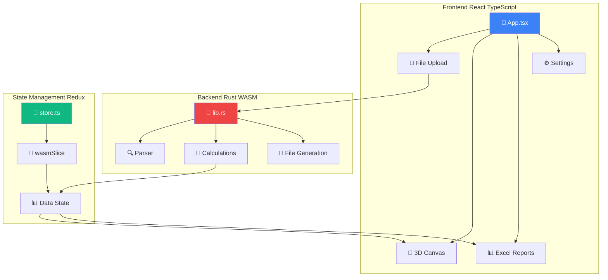
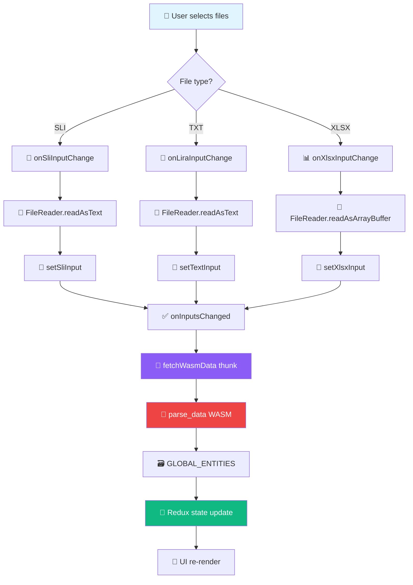
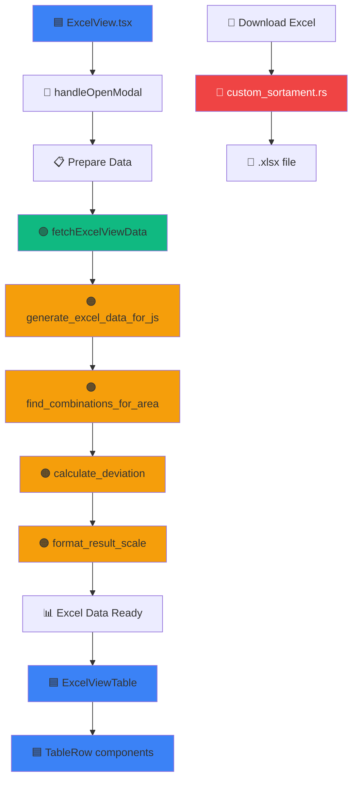
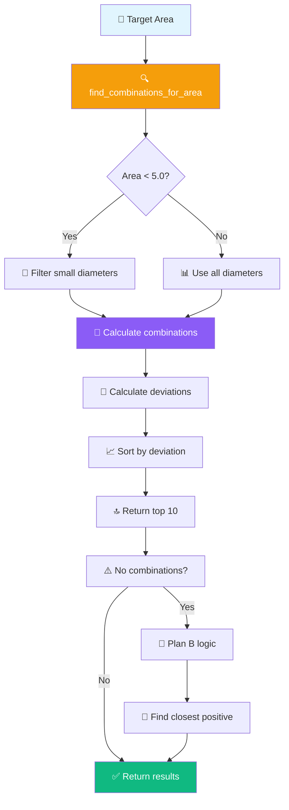
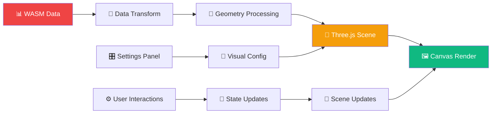
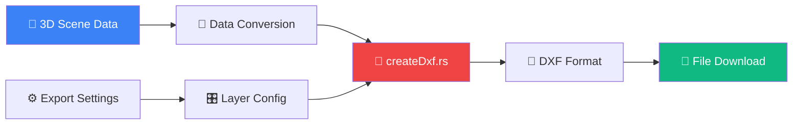

## 🏗️ Общая архитектура проекта

```mermaid

flowchart TB

subgraph "Frontend React TypeScript"

A["📱 App.tsx"] --> B["📂 File Upload"]

A --> C["🎨 3D Canvas"]

A --> D["📊 Excel Reports"]

A --> E["⚙️ Settings"]

end

subgraph "Backend Rust WASM"

F["📝 lib.rs"] --> G["🔍 Parser"]

F --> H["🧮 Calculations"]

F --> I["📄 File Generation"]

end

subgraph "State Management Redux"

J["🏪 store.ts"] --> K["🔄 wasmSlice"]

K --> L["📊 Data State"]

end

B --> F

H --> L

L --> C

L --> D

style A fill:#3b82f6,color:#fff

style F fill:#ef4444,color:#fff

style J fill:#10b981,color:#fff

```

## 📁 Поток загрузки файлов

```mermaid

flowchart TD

A["📁 User selects files"] --> B{"File type?"}

B -->|SLI| C["📄 onSliInputChange"]

B -->|TXT| D["📝 onLiraInputChange"]

B -->|XLSX| E["📊 onXlsxInputChange"]

C --> F["🔄 FileReader.readAsText"]

D --> G["🔄 FileReader.readAsText"]

E --> H["🔄 FileReader.readAsArrayBuffer"]

F --> I["💾 setSliInput"]

G --> J["💾 setTextInput"]

H --> K["💾 setXlsxInput"]

I --> L["✅ onInputsChanged"]

J --> L

K --> L

L --> M["🚀 fetchWasmData thunk"]

M --> N["🦀 parse_data WASM"]

N --> O["🗃️ GLOBAL_ENTITIES"]

O --> P["🔄 Redux state update"]

P --> Q["🎨 UI re-render"]

style A fill:#e1f5fe

style M fill:#8b5cf6,color:#fff

style N fill:#ef4444,color:#fff

style P fill:#10b981,color:#fff

```

## 📊 Excel отчеты поток

```mermaid

flowchart TD

A["🟦 ExcelView.tsx"] --> B["🔘 handleOpenModal"]

B --> C["📋 Prepare Data"]

C --> D["🟢 fetchExcelViewData"]

D --> E["🟠 generate_excel_data_for_js"]

E --> F["🟠 find_combinations_for_area"]

F --> G["🟠 calculate_deviation"]

G --> H["🟠 format_result_scale"]

H --> I["📊 Excel Data Ready"]

I --> J["🟦 ExcelViewTable"]

J --> K["🟦 TableRow components"]

L["💾 Download Excel"] --> M["🦀 custom_sortament.rs"]

M --> N["📄 .xlsx file"]

style A fill:#3b82f6

style D fill:#10b981

style E fill:#f59e0b

style F fill:#f59e0b

style G fill:#f59e0b

style H fill:#f59e0b

style J fill:#3b82f6

style K fill:#3b82f6

style M fill:#ef4444,color:#fff

```

## 🔧 Расчет арматуры поток

```mermaid

flowchart TB

A["📐 Target Area"] --> B["🔍 find_combinations_for_area"]

B --> C{"Area < 5.0?"}

C -->|Yes| D["🎯 Filter small diameters"]

C -->|No| E["📊 Use all diameters"]

D --> F["🧮 Calculate combinations"]

E --> F

F --> G["📏 Calculate deviations"]

G --> H["📈 Sort by deviation"]

H --> I["🔝 Return top 10"]

J["⚠️ No combinations?"]

I --> J

J -->|Yes| K["🔄 Plan B logic"]

J -->|No| L["✅ Return results"]

K --> M["🎯 Find closest positive"]

M --> L

style A fill:#e1f5fe

style B fill:#f59e0b,color:#fff

style F fill:#8b5cf6,color:#fff

style L fill:#10b981,color:#fff

```

## 🎨 3D Визуализация поток

```mermaid

flowchart LR

A["📊 WASM Data"] --> B["🔄 Data Transform"]

B --> C["📐 Geometry Processing"]

C --> D["🎨 Three.js Scene"]

D --> E["🖼️ Canvas Render"]

F["⚙️ User Interactions"] --> G["🔄 State Updates"]

G --> H["🎯 Scene Updates"]

H --> E

I["🎛️ Settings Panel"] --> J["🎨 Visual Config"]

J --> D

style A fill:#ef4444,color:#fff

style D fill:#f59e0b,color:#fff

style E fill:#10b981,color:#fff

```

## 📄 DXF экспорт поток

```mermaid

flowchart LR

A["🎨 3D Scene Data"] --> B["🔄 Data Conversion"]

B --> C["🦀 createDxf.rs"]

C --> D["📐 DXF Format"]

D --> E["💾 File Download"]

F["⚙️ Export Settings"] --> G["🎛️ Layer Config"]

G --> C

style A fill:#3b82f6,color:#fff

style C fill:#ef4444,color:#fff

style E fill:#10b981,color:#fff

```
