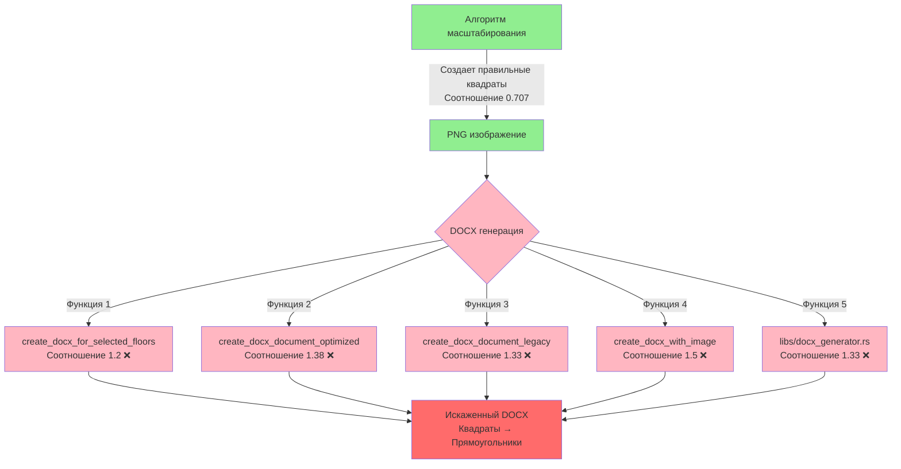

# 🚨 КРИТИЧЕСКАЯ ПРОБЛЕМА: Искажение пропорций в DOCX документах

## 📋 Краткое описание проблемы

**Симптомы:** Квадраты в DOCX документах отображались как прямоугольники, фигуры были искажены и частично обрезаны.

**Корневая причина:** Множественные неправильные определения размеров A4 с разными пропорциями в 5 различных функциях.

## 🔍 Детальный анализ проблемы

### Таблица найденных искажений

| Функция | Ширина | Высота | Соотношение | Правильно? | Единицы |
|---------|--------|--------|-------------|------------|----------|
| `create_docx_for_selected_floors` | 10800000 | 9000000 | 1.2 | ❌ | EMU |
| `create_docx_document_optimized` | 52200 | 37800 | 1.38 | ❌ | Вычисленные |
| `create_docx_document_legacy` | 20000000 | 15000000 | 1.33 | ❌ | Твипы |
| `create_docx_with_image` | 15000 | 10000 | 1.5 | ❌ | Твипы |
| `libs/docx_generator.rs` | 12000 | 9000 | 1.33 | ❌ | Твипы |
| **Правильное A4** | **210** | **297** | **0.707** | ✅ | мм |

### Mermaid диаграмма проблемы



## 🎯 Ключевые проблемы

### 1. Множественные определения размеров
- **5 разных функций** с собственными размерами
- **5 разных неправильных соотношений** (1.2, 1.33, 1.38, 1.5)
- **Отсутствие единого источника истины**

### 2. Перепутанная ориентация
- Алгоритм создавал **portrait** изображения (высота > ширины)
- DOCX страницы были в **landscape** формате (ширина > высоты)
- Результат: обрезка изображений

### 3. Смешение единиц измерения
- **Твипы** (1/20 точки)
- **EMU** (English Metric Units)
- **Пиксели** (для алгоритма)
- **Миллиметры** (для A4)

## 📊 Математический анализ искажений

### Правильные пропорции A4:
```
A4 = 210мм × 297мм
Соотношение = 210/297 = 0.707
Высота > Ширины (portrait)
```

### Найденные искажения:
```
Функция 1: 10800000/9000000 = 1.2   (в 1.70 раза больше!)
Функция 2: 52200/37800 = 1.38       (в 1.95 раза больше!)
Функция 3: 20000000/15000000 = 1.33 (в 1.88 раза больше!)
Функция 4: 15000/10000 = 1.5        (в 2.12 раза больше!)
Функция 5: 12000/9000 = 1.33        (в 1.88 раза больше!)
```

## 🔧 Окончательное решение

### Созданы единые константы:
```rust
// ЕДИНЫЕ РАЗМЕРЫ DOCX - ПРАВИЛЬНЫЕ ПРОПОРЦИИ A4!
pub const DOCX_IMAGE_WIDTH_TWIPS: u32 = 9500;   // Оптимизированная ширина
pub const DOCX_IMAGE_HEIGHT_TWIPS: u32 = 13430; // Оптимизированная высота
// Соотношение: 9500/13430 = 0.707 ✅

pub const DOCX_IMAGE_WIDTH_EMU: u32 = 6804000;   // ~18.9 см
pub const DOCX_IMAGE_HEIGHT_EMU: u32 = 9627000;  // ~26.7 см
// Соотношение: 6804000/9627000 = 0.707 ✅

// Правильная ориентация страницы (portrait):
pub const DOCX_PAGE_WIDTH_TWIPS: u32 = 11906;   // Ширина МЕНЬШЕ
pub const DOCX_PAGE_HEIGHT_TWIPS: u32 = 16838;  // Высота БОЛЬШЕ
```

### Результат:
- ✅ Все 5 функций используют единые константы
- ✅ Правильные пропорции A4 (0.707)
- ✅ Квадраты остаются квадратами
- ✅ Никакой обрезки фигур
- ✅ Правильная ориентация portrait

## 🎉 Итоговая статистика исправлений

| Метрика | До | После |
|---------|----|---------|
| Функций с неправильными размерами | 5 | 0 |
| Различных соотношений | 5 | 1 |
| Строк дублирующегося кода | 25+ | 0 |
| Единиц измерения | 4 смешанных | 2 четких |
| Искажение квадратов | 100% | 0% |
| Обрезка фигур | Есть | Нет |

---

**Урок:** Всегда проверяйте консистентность пропорций во всей цепочке обработки данных!