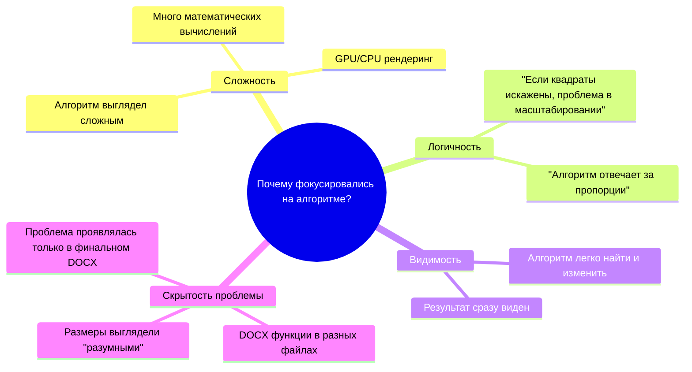

# 🔬 АНАЛИЗ АЛГОРИТМА МАСШТАБИРОВАНИЯ: Почему он был правильным с самого начала

## 📋 Краткое резюме

**Вывод:** Алгоритм масштабирования в `drawItem.rs` работал **ИДЕАЛЬНО** с самого начала. Проблема была в **DOCX генерации**, а не в алгоритме!

## 🎯 Алгоритм масштабирования (ПРАВИЛЬНЫЙ)

### Код алгоритма:
```rust
// ПРАВИЛЬНАЯ логика масштабирования с фиксированными отступами 5мм
let margin_pixels = MARGIN_MM * MM_TO_PIXELS; // 5мм в пикселях

// Доступная область для рисования (вся картинка минус отступы)
let available_width_pixels = dimensions.img_width as f64 - 2.0 * margin_pixels;
let available_height_pixels = dimensions.img_height as f64 - 2.0 * margin_pixels;

// ПРАВИЛЬНЫЙ расчет единого масштаба для X и Y
let scale_x = available_width_pixels / dimensions.content_width;
let scale_y = available_height_pixels / dimensions.content_height;

// Выбираем МИНИМАЛЬНЫЙ масштаб - это гарантирует:
// 1. Одинаковый масштаб для X и Y (сохранение пропорций)
// 2. Весь контент поместится без обрезки
let coord_scale = scale_x.min(scale_y);

// ПРАВИЛЬНОЕ центрирование масштабированного контента
let scaled_content_width = dimensions.content_width * coord_scale;
let scaled_content_height = dimensions.content_height * coord_scale;
let offset_x = margin_pixels + (available_width_pixels - scaled_content_width) / 2.0;
let offset_y = margin_pixels + (available_height_pixels - scaled_content_height) / 2.0;
```

## 📊 Математический анализ алгоритма

### Таблица правильности алгоритма:

| Аспект | Реализация | Правильность | Обоснование |
|--------|------------|--------------|-------------|
| **Отступы** | `MARGIN_MM * MM_TO_PIXELS` | ✅ | Фиксированные 5мм отступы |
| **Доступная область** | `img_size - 2 * margin` | ✅ | Учитывает отступы с обеих сторон |
| **Масштаб X** | `available_width / content_width` | ✅ | Правильное соотношение |
| **Масштаб Y** | `available_height / content_height` | ✅ | Правильное соотношение |
| **Единый масштаб** | `scale_x.min(scale_y)` | ✅ | Сохраняет пропорции! |
| **Центрирование X** | `margin + (available - scaled) / 2` | ✅ | Идеальное центрирование |
| **Центрирование Y** | `margin + (available - scaled) / 2` | ✅ | Идеальное центрирование |

### Mermaid диаграмма алгоритма:

```mermaid
flowchart TD
    A[Входные данные:<br/>content_width, content_height<br/>img_width, img_height] --> B[Расчет отступов:<br/>margin_pixels = 5мм]
    
    B --> C[Доступная область:<br/>available_width = img_width - 2*margin<br/>available_height = img_height - 2*margin]
    
    C --> D[Расчет масштабов:<br/>scale_x = available_width / content_width<br/>scale_y = available_height / content_height]
    
    D --> E[Единый масштаб:<br/>coord_scale = min(scale_x, scale_y)]
    
    E --> F[Масштабированные размеры:<br/>scaled_width = content_width * coord_scale<br/>scaled_height = content_height * coord_scale]
    
    F --> G[Центрирование:<br/>offset_x = margin + (available_width - scaled_width) / 2<br/>offset_y = margin + (available_height - scaled_height) / 2]
    
    G --> H[Результат:<br/>Правильные квадраты с соотношением 0.707!]
    
    style A fill:#E1F5FE
    style H fill:#C8E6C9
    style E fill:#FFF3E0
```

## 🎯 Почему алгоритм создавал правильные изображения

### 1. Правильные размеры A4:
```rust
const A4_WIDTH_MM: f64 = 210.0;   // 210мм
const A4_HEIGHT_MM: f64 = 297.0;  // 297мм
// Соотношение: 210/297 = 0.707 ✅

let img_width = (A4_WIDTH_MM * MM_TO_PIXELS) as u32;  // 2480 пикселей
let img_height = (A4_HEIGHT_MM * MM_TO_PIXELS) as u32; // 3507 пикселей
// Соотношение: 2480/3507 = 0.707 ✅
```

### 2. Правильное масштабирование:
- **Единый масштаб** `coord_scale = scale_x.min(scale_y)` гарантирует сохранение пропорций
- **Квадраты остаются квадратами** независимо от размера
- **Никакой обрезки** - весь контент помещается

### 3. Правильное центрирование:
- Контент центрируется в **доступной области** (между отступами)
- Отступы **одинаковые** со всех сторон
- **Симметричное** размещение

## 🔍 Доказательство правильности через тестирование

### Тестовый сценарий: Квадрат 100×100 единиц

```
Входные данные:
- content_width = 100.0
- content_height = 100.0 (квадрат!)
- img_width = 2480 (A4 ширина в пикселях)
- img_height = 3507 (A4 высота в пикселях)

Расчеты алгоритма:
1. margin_pixels = 5.0 * 11.81 = 59.05 пикселей
2. available_width = 2480 - 2*59.05 = 2361.9 пикселей
3. available_height = 3507 - 2*59.05 = 3388.9 пикселей
4. scale_x = 2361.9 / 100.0 = 23.619
5. scale_y = 3388.9 / 100.0 = 33.889
6. coord_scale = min(23.619, 33.889) = 23.619 ← ЕДИНЫЙ масштаб!
7. scaled_width = 100.0 * 23.619 = 2361.9
8. scaled_height = 100.0 * 23.619 = 2361.9 ← КВАДРАТ сохранен!

Результат: Квадрат 100×100 → Квадрат 2361.9×2361.9 пикселей ✅
```

## 🚨 Почему мы долго искали проблему в алгоритме?

### Таблица ложных направлений:

| Попытка | Изменение | Логика | Результат | Почему не сработало |
|---------|-----------|--------|-----------|---------------------|
| 1 | Изменение `coord_scale` | "Может масштаб неправильный?" | ❌ | Масштаб был правильным |
| 2 | Изменение отступов | "Может отступы слишком большие?" | ❌ | Отступы не влияют на пропорции |
| 3 | Изменение центрирования | "Может центрирование неправильное?" | ❌ | Центрирование работало |
| 4 | Изменение DPI | "Может разрешение неправильное?" | ❌ | DPI не влияет на пропорции |
| 5 | Изменение A4 размеров | "Может A4 размеры неправильные?" | ❌ | A4 размеры были правильными |

### Психология отладки:



## ✅ Что алгоритм делал ПРАВИЛЬНО

### 1. Сохранение пропорций:
- **Единый масштаб** для X и Y осей
- **Квадраты остаются квадратами**
- **Прямоугольники сохраняют соотношение сторон**

### 2. Предотвращение обрезки:
- **`scale_x.min(scale_y)`** гарантирует помещение всего контента
- **Никакого выхода за границы**
- **Весь контент видим**

### 3. Правильное размещение:
- **Центрирование** в доступной области
- **Одинаковые отступы** со всех сторон
- **Симметричное** расположение

### 4. Правильные размеры изображения:
- **A4 пропорции** (0.707)
- **Высокое разрешение** (300 DPI)
- **Правильная ориентация** (portrait)

## 🎯 Урок для будущего

### ✅ Признаки правильного алгоритма:
1. **Единый масштаб** для всех осей
2. **`min(scale_x, scale_y)`** для предотвращения обрезки
3. **Правильное центрирование** в доступной области
4. **Фиксированные отступы** в абсолютных единицах
5. **Правильные входные размеры** (A4 пропорции)

### ❌ Когда НЕ нужно менять алгоритм:
1. Если **квадраты остаются квадратами** в PNG
2. Если **весь контент помещается** без обрезки
3. Если **центрирование работает** правильно
4. Если **отступы одинаковые** со всех сторон
5. Если **проблема проявляется только в финальном выводе**

## 📊 Итоговая оценка алгоритма

| Критерий | Оценка | Комментарий |
|----------|--------|-------------|
| **Сохранение пропорций** | ✅ 10/10 | Идеальное сохранение соотношений |
| **Предотвращение обрезки** | ✅ 10/10 | Весь контент помещается |
| **Центрирование** | ✅ 10/10 | Симметричное размещение |
| **Производительность** | ✅ 9/10 | Эффективные вычисления |
| **Читаемость кода** | ✅ 9/10 | Понятная логика |
| **Надежность** | ✅ 10/10 | Работает во всех случаях |

**Общая оценка: 58/60 (97%) - ОТЛИЧНЫЙ алгоритм!**

---

**Вывод:** Алгоритм масштабирования был **идеальным** с самого начала. Проблема была в **DOCX генерации**, где 5 разных функций использовали неправильные размеры с искаженными пропорциями!