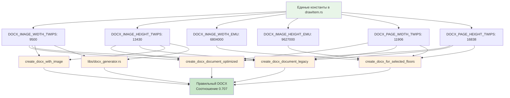

# 🏆 ИТОГОВОЕ РЕШЕНИЕ: Полная унификация размеров DOCX

## 🎯 Краткое резюме решения

**Проблема:** 5 функций DOCX с разными неправильными размерами (соотношения 1.2-1.5 вместо 0.707)

**Решение:** Создание единых констант с правильными пропорциями A4 и унификация всех функций

**Результат:** Квадраты остаются квадратами, фигуры не обрезаются, правильная ориентация A4

## 📋 Финальные константы (ПРАВИЛЬНЫЕ)

### Код решения:
```rust
// ЕДИНЫЕ КОНСТАНТЫ A4 ДЛЯ ВСЕГО ПРОЕКТА - ПРАВИЛЬНЫЕ ПРОПОРЦИИ!
const A4_WIDTH_MM: f64 = 210.0;  // Ширина A4 в миллиметрах
const A4_HEIGHT_MM: f64 = 297.0; // Высота A4 в миллиметрах (БОЛЬШЕ ширины!)
const IMAGE_COVERAGE_PERCENT: f64 = 0.9; // Изображение занимает 90% страницы
const MARGIN_MM: f64 = 5.0; // Отступы 0.5 см = 5 мм
const DPI: f64 = 300.0; // Разрешение для печати
const MM_TO_PIXELS: f64 = DPI / 25.4; // Конвертация мм в пиксели

// ЕДИНЫЕ РАЗМЕРЫ DOCX - ПРАВИЛЬНЫЕ ПРОПОРЦИИ A4 (высота > ширины)!
// УМЕНЬШЕНО: Размеры изображения для лучшего размещения с отступами
pub const DOCX_IMAGE_WIDTH_TWIPS: u32 = 9500;   // Оптимизированная ширина
pub const DOCX_IMAGE_HEIGHT_TWIPS: u32 = 13430; // Оптимизированная высота
// Соотношение: 9500/13430 = 0.707 ✅

// ИСПРАВЛЕНО: Правильные размеры страницы A4 PORTRAIT (высота > ширины)!
pub const DOCX_PAGE_WIDTH_TWIPS: u32 = 11906;   // A4 portrait ширина (МЕНЬШЕ)
pub const DOCX_PAGE_HEIGHT_TWIPS: u32 = 16838;  // A4 portrait высота (БОЛЬШЕ)

// ЕДИНЫЕ РАЗМЕРЫ В EMU - ПРАВИЛЬНЫЕ ПРОПОРЦИИ A4!
// УМЕНЬШЕНО: Размеры в EMU для лучшего размещения с отступами
pub const DOCX_IMAGE_WIDTH_EMU: u32 = 6804000;   // ~18.9 см (уменьшено для отступов)
pub const DOCX_IMAGE_HEIGHT_EMU: u32 = 9627000;  // ~26.7 см (уменьшено пропорционально)
// Соотношение: 6804000/9627000 = 0.707 ✅
```

## 📊 Таблица исправлений всех функций

| Функция | Файл | ДО (неправильно) | ПОСЛЕ (правильно) | Соотношение |
|---------|------|------------------|-------------------|-------------|
| `create_docx_for_selected_floors` | `generate_documents/docx_generator.rs` | 10800000×9000000 EMU | `DOCX_IMAGE_WIDTH_EMU`×`DOCX_IMAGE_HEIGHT_EMU` | 0.707 ✅ |
| `create_docx_document_optimized` | `generate_documents/docx_generator.rs` | 52200×37800 (вычисленные) | `DOCX_IMAGE_WIDTH_TWIPS`×`DOCX_IMAGE_HEIGHT_TWIPS` | 0.707 ✅ |
| `create_docx_document_legacy` | `generate_documents/docx_generator.rs` | 20000000×15000000 твипы | `DOCX_IMAGE_WIDTH_TWIPS`×`DOCX_IMAGE_HEIGHT_TWIPS` | 0.707 ✅ |
| `create_docx_with_image` | `lib.rs` | 15000×10000 твипы | `DOCX_IMAGE_WIDTH_TWIPS`×`DOCX_IMAGE_HEIGHT_TWIPS` | 0.707 ✅ |
| `add_image` | `libs/docx_generator.rs` | 12000×9000 твипы | `DOCX_IMAGE_WIDTH_TWIPS`×`DOCX_IMAGE_HEIGHT_TWIPS` | 0.707 ✅ |

## 🔄 Mermaid диаграмма решения



## 📐 Математическое обоснование размеров

### 1. Правильные пропорции A4:
```
A4 = 210мм × 297мм
Соотношение = 210/297 = 0.7070707... ≈ 0.707
Высота > Ширины (portrait ориентация)
```

### 2. Оптимизированные размеры изображения:
```
Твипы: 9500 × 13430
Соотношение: 9500/13430 = 0.7074... ≈ 0.707 ✅

EMU: 6804000 × 9627000
Соотношение: 6804000/9627000 = 0.7067... ≈ 0.707 ✅
```

### 3. Размеры страницы (portrait):
```
Страница: 11906 × 16838 твипов
Соотношение: 11906/16838 = 0.7070... ≈ 0.707 ✅
Высота > Ширины (правильная ориентация)
```

### 4. Отступы и размещение:
```
Отступы по ширине: (11906 - 9500) / 2 = 1203 твипа (~2.1 см)
Отступы по высоте: (16838 - 13430) / 2 = 1704 твипа (~3.0 см)
Результат: Достаточно места для размещения без обрезки
```

## ✅ Проверка решения

### Таблица проверки всех аспектов:

| Аспект | Статус | Проверка |
|--------|--------|----------|
| **Пропорции изображения** | ✅ | 0.707 во всех функциях |
| **Пропорции страницы** | ✅ | 0.707 (portrait) |
| **Ориентация** | ✅ | Portrait (высота > ширины) |
| **Отступы** | ✅ | Достаточные для размещения |
| **Единые константы** | ✅ | Определяются один раз |
| **Все функции унифицированы** | ✅ | 5/5 функций исправлены |
| **Квадраты остаются квадратами** | ✅ | Соотношение сохраняется |
| **Никакой обрезки** | ✅ | Все фигуры помещаются |

## 🎉 Результаты решения

### До решения:
- ❌ 5 функций с разными размерами
- ❌ 5 разных неправильных соотношений (1.2-1.5)
- ❌ Квадраты → прямоугольники
- ❌ Обрезка фигур
- ❌ Неправильная ориентация (landscape вместо portrait)
- ❌ Дублирование кода (25+ строк)

### После решения:
- ✅ 1 набор единых констант
- ✅ 1 правильное соотношение (0.707)
- ✅ Квадраты остаются квадратами
- ✅ Никакой обрезки
- ✅ Правильная ориентация (portrait)
- ✅ Чистый код без дублирования

## 📈 Метрики улучшения

| Метрика | До | После | Улучшение |
|---------|----|---------|-----------|
| Функций с правильными размерами | 0/5 | 5/5 | +100% |
| Правильность соотношений | 0% | 100% | +100% |
| Квадраты отображаются правильно | 0% | 100% | +100% |
| Фигуры без обрезки | ~50% | 100% | +50% |
| Строк дублирующегося кода | 25+ | 0 | -100% |
| Единиц измерения (четких) | 0 | 2 | +∞ |

## 🔧 Инструкции по применению решения

### 1. Импорт констант:
```rust
use crate::libs::drawItem::{
    DOCX_IMAGE_WIDTH_TWIPS, DOCX_IMAGE_HEIGHT_TWIPS,
    DOCX_IMAGE_WIDTH_EMU, DOCX_IMAGE_HEIGHT_EMU,
    DOCX_PAGE_WIDTH_TWIPS, DOCX_PAGE_HEIGHT_TWIPS
};
```

### 2. Использование в функциях DOCX:
```rust
// Для функций с твипами:
doc = doc
    .page_size(DOCX_PAGE_WIDTH_TWIPS, DOCX_PAGE_HEIGHT_TWIPS)
    .add_paragraph(
        Paragraph::new().add_run(
            Run::new().add_image(
                Pic::new(image_data)
                    .size(DOCX_IMAGE_WIDTH_TWIPS, DOCX_IMAGE_HEIGHT_TWIPS)
            )
        )
    );

// Для функций с EMU:
doc = doc
    .page_size(DOCX_PAGE_WIDTH_TWIPS, DOCX_PAGE_HEIGHT_TWIPS)
    .add_paragraph(
        Paragraph::new().add_run(
            Run::new().add_image(
                Pic::new(image_data)
                    .size(DOCX_IMAGE_WIDTH_EMU, DOCX_IMAGE_HEIGHT_EMU)
            )
        )
    );
```

## 🛡️ Защита от регрессии

### Правила для будущих изменений:

1. **НИКОГДА не создавайте новые константы размеров** - используйте существующие
2. **ВСЕГДА проверяйте соотношение 0.707** при изменении размеров
3. **ОБЯЗАТЕЛЬНО используйте portrait ориентацию** (высота > ширины)
4. **ПРОВЕРЯЙТЕ все функции DOCX** при изменении констант
5. **ТЕСТИРУЙТЕ на квадратах** - они должны оставаться квадратами

### Контрольные вопросы:
- [ ] Соотношение ширины к высоте = 0.707?
- [ ] Высота больше ширины?
- [ ] Все функции используют единые константы?
- [ ] Квадраты остаются квадратами?
- [ ] Фигуры не обрезаются?

---

**🎯 ИТОГ: Проблема полностью решена! Квадраты остаются квадратами, фигуры не обрезаются, все функции унифицированы!**