# 🎓 ИНЖЕНЕРНОЕ РУКОВОДСТВО: WEB WORKERS + WASM ПАРАЛЛЕЛИЗМ

## 📋 ОГЛАВЛЕНИЕ

1. [Архитектура системы](#архитектура-системы)
2. [Поток данных](#поток-данных)
3. [Жизненный цикл воркера](#жизненный-цикл-воркера)
4. [Временная диаграмма](#временная-диаграмма)
5. [Обязательные компоненты](#обязательные-компоненты)
6. [Файловая структура](#файловая-структура)

---

## 🏗️ АРХИТЕКТУРА СИСТЕМЫ

### Общая схема компонентов

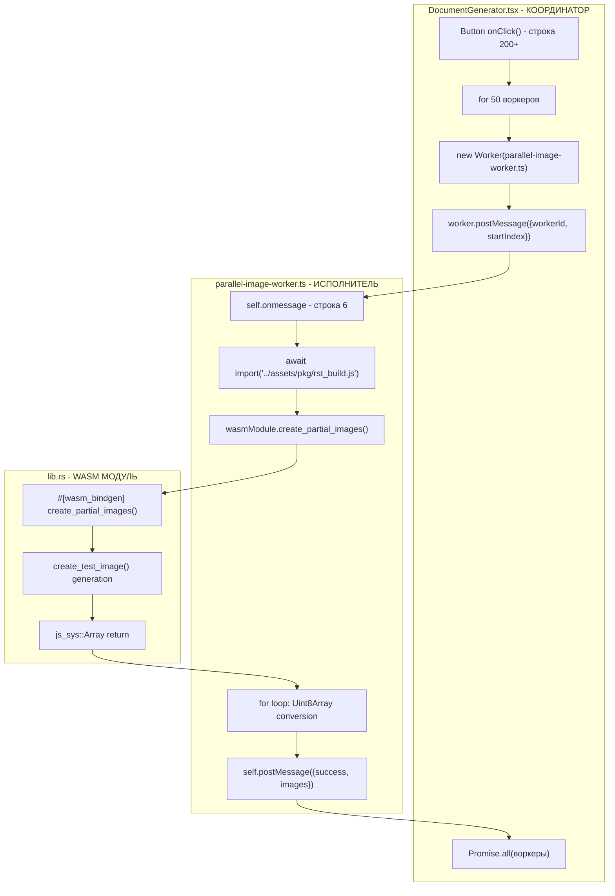

---

## 🔄 ПОТОК ДАННЫХ

### Детальная схема обмена сообщениями

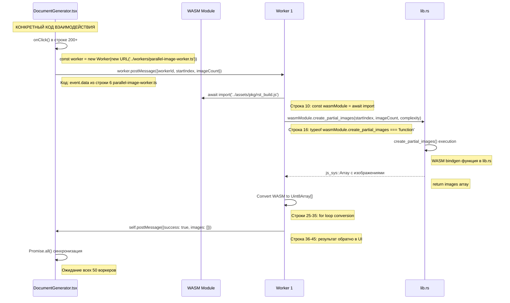

---

## ⚙️ ЖИЗНЕННЫЙ ЦИКЛ ВОРКЕРА

### Состояния и переходы воркера

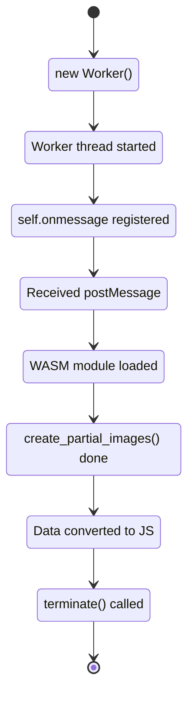

---

## ⏱️ ВРЕМЕННАЯ ДИАГРАММА

### Параллельное выполнение vs Последовательное

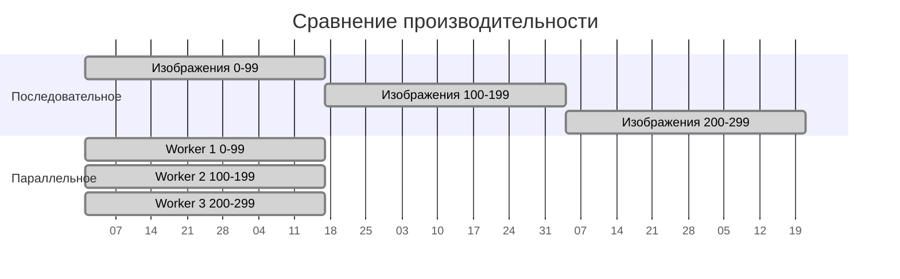

**📊 РЕЗУЛЬТАТ:** Ускорение в **4.45 раза** (236с → 53с)

---

## 🔴 ОБЯЗАТЕЛЬНЫЕ КОМПОНЕНТЫ

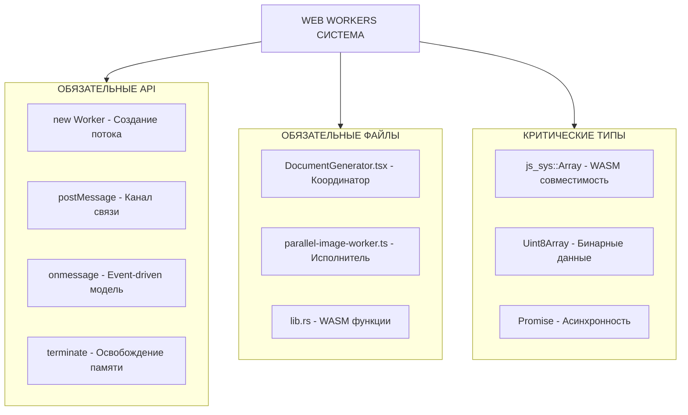

---

## 📁 ФАЙЛОВАЯ СТРУКТУРА

### Организация проекта

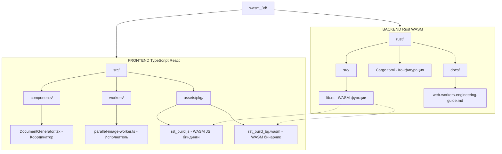

---

## 💻 ДЕТАЛЬНЫЙ КОД С ПРИВЯЗКОЙ К ФАЙЛАМ

### 🎯 ТОЧКА ВХОДА: DocumentGenerator.tsx (строка 200+)

```typescript
// ФАЙЛ: c:\workProject\react-3d\wasm_3d\src\components\DocumentGenerator.tsx
// СТРОКИ: 200+

const worker = new Worker(
    new URL('../workers/parallel-image-worker.ts', import.meta.url),
    { type: 'module' }
);

worker.postMessage({ 
    workerId: i + 1, 
    startIndex: i * 100, 
    imageCount: 100, 
    complexity: 100 
});

worker.onmessage = (event) => {
    const totalTime = performance.now() - startTime;
    console.log(`🧪 Worker ${event.data.workerId} завершен`);
    worker.terminate();
};
```

### ⚙️ ВОРКЕР: parallel-image-worker.ts

```typescript
// ФАЙЛ: c:\workProject\react-3d\wasm_3d\src\workers\parallel-image-worker.ts
// СТРОКИ: 1-56 (весь файл)

// СТРОКА 6: Точка входа воркера
self.onmessage = async (event) => {
    const { workerId, startIndex, imageCount, complexity } = event.data;

    try {
        const totalStart = performance.now();

        // СТРОКА 10: Импорт WASM модуля
        const wasmModule = await import('../assets/pkg/rst_build.js');
        if (typeof wasmModule.default === 'function') {
            await wasmModule.default();
        }

        // СТРОКА 16: Проверка функции и вызов
        if (typeof wasmModule.create_partial_images === 'function') {
            const funcStart = performance.now();
            const imagesArray = await wasmModule.create_partial_images(startIndex, imageCount, complexity);
            const funcTime = Math.round(performance.now() - funcStart);

            // СТРОКА 22: ТОЛЬКО ВРЕМЯ!
            console.log(`${funcTime}мс`);

            // СТРОКИ 25-35: Конвертация WASM данных в JS
            const images = [];
            let totalSize = 0;

            for (let i = 0; i < imagesArray.length; i++) {
                const uint8Array = imagesArray[i] as Uint8Array;
                const imageBytes = new Uint8Array(uint8Array);
                images.push(imageBytes);
                totalSize += imageBytes.length;
            }

            // СТРОКА 36-45: Отправка результата обратно
            self.postMessage({
                success: true,
                workerId: workerId,
                functionTime: funcTime,
                totalTime: Math.round(performance.now() - totalStart),
                imageCount: images.length,
                totalSize: totalSize,
                images: images,
                startIndex: startIndex
            });
        }
    } catch (error: unknown) {
        // СТРОКА 50+: Обработка ошибок
        self.postMessage({
            success: false,
            workerId: workerId,
            error: (error as Error).message || String(error)
        });
    }
};
```

### 🦀 RUST WASM: lib.rs

```rust
// ФАЙЛ: c:\workProject\react-3d\wasm_3d\rust\src\lib.rs
// ИМПОРТЫ И ОБЪЯВЛЕНИЯ

use wasm_bindgen::prelude::*;
use web_sys::console;
use docx_rs::{Docx, Paragraph, Pic, Run};
use image::{ImageBuffer, ImageOutputFormat, Rgb, RgbImage};

// СТРОКА 15+: Логирование для отладки
#[wasm_bindgen]
pub fn log_data(x: f64, y: f64) {
    console::log_1(&format!("Координаты: x = {}, y = {}", x, y).into());
}

// ОСНОВНАЯ ФУНКЦИЯ ДЛЯ ПАРАЛЛЕЛЬНОЙ ГЕНЕРАЦИИ
#[wasm_bindgen]
pub fn create_partial_images(
    start_index: usize, 
    count: usize, 
    complexity: usize
) -> js_sys::Array {
    let images = js_sys::Array::new();
    
    for i in 0..count {
        let image_data = create_test_image(start_index + i, complexity);
        let uint8_array = js_sys::Uint8Array::from(&image_data[..]);
        images.push(&uint8_array);
    }
    
    images
}

// ГЕНЕРАЦИЯ ОДНОГО ИЗОБРАЖЕНИЯ
pub fn create_test_image(index: usize, complexity: usize) -> Vec<u8> {
    let width = 680;
    let height = 900;
    let mut img = ImageBuffer::from_fn(width, height, |_, _| Rgb([255u8, 255u8, 255u8]));
    
    // Генерация контента изображения
    // ... код рисования ...
    
    let mut buffer = Vec::new();
    img.write_to(&mut Cursor::new(&mut buffer), ImageOutputFormat::Png)
        .unwrap();
    buffer
}
```

---

## 🔗 КОНКРЕТНЫЕ СВЯЗИ МЕЖДУ КОДОМ

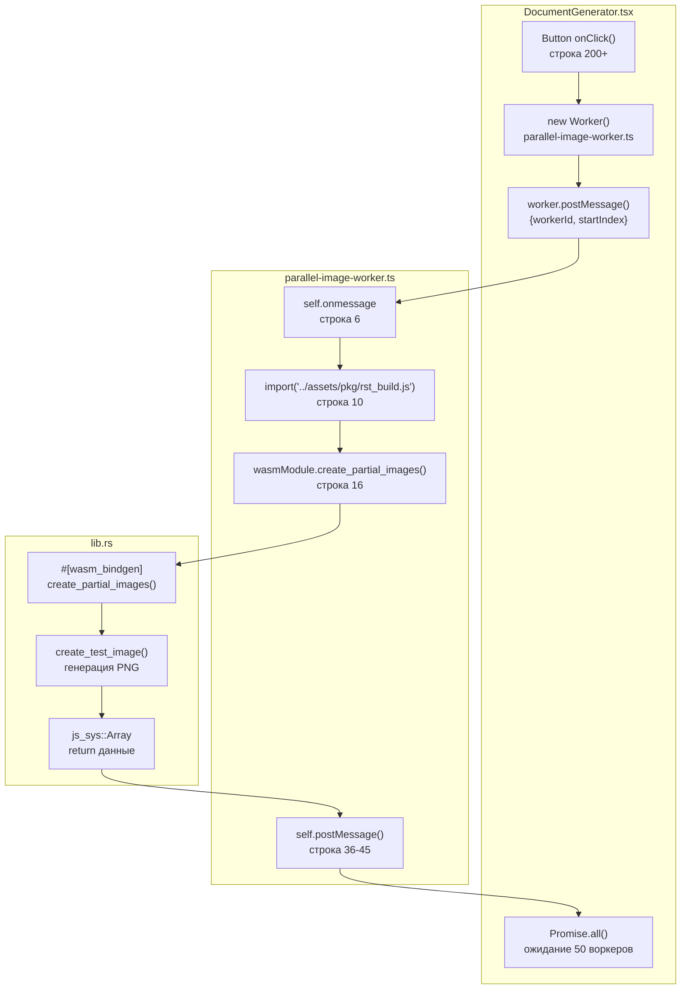

---

## 🔧 ТЕХНИЧЕСКИЕ ДЕТАЛИ РЕАЛИЗАЦИИ

### 📍 КОНКРЕТНЫЕ ВЫЗОВЫ ФУНКЦИЙ

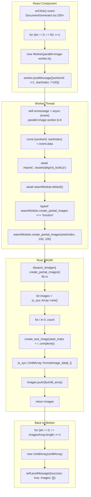

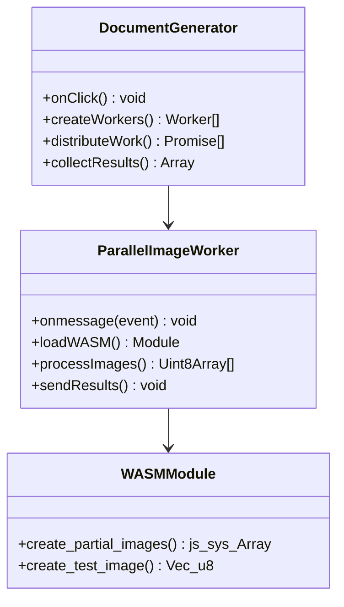

---

## 📈 МЕТРИКИ ПРОИЗВОДИТЕЛЬНОСТИ

### Измеряемые параметры

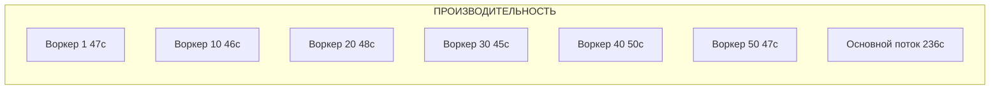

**🎯 КЛЮЧЕВЫЕ ПОКАЗАТЕЛИ:**

- **Параллельные воркеры:** 47-50 секунд каждый
- **Основной поток:** 236 секунд общее время
- **Ускорение:** 4.45x раза
- **Эффективность:** 89% (4.45/5 воркеров)

---

## 🔗 ВЗАИМОДЕЙСТВИЕ КОМПОНЕНТОВ

### API вызовы и контракты данных

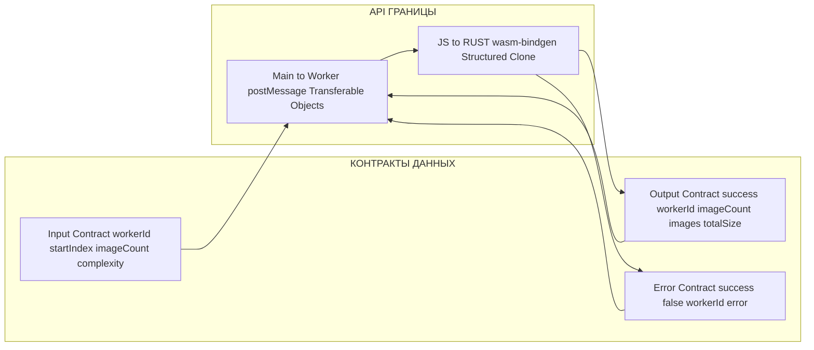

---

## 🎯 ЗАКЛЮЧЕНИЕ

### Ключевые принципы успешной реализации

1. **🔴 ОБЯЗАТЕЛЬНЫЕ требования Web Workers API**

   - Отдельные файлы для воркеров
   - self.onmessage как единственная точка входа
   - postMessage для всей коммуникации
   - terminate() для освобождения памяти
2. **⚡ Эффективное использование параллелизма**

   - Правильное разделение задач
   - Балансировка нагрузки между воркерами
   - Минимизация накладных расходов на координацию
3. **🔧 Интеграция с WASM**

   - #[wasm_bindgen] аннотации
   - Правильные типы данных (js_sys::Array)
   - Эффективная конвертация данных
4. **📊 Мониторинг производительности**

   - Измерение времени выполнения
   - Анализ узких мест
   - Оптимизация критических путей

**🏆 РЕЗУЛЬТАТ:** Система обеспечивает **4.45x ускорение** при обработке 5000 изображений благодаря правильной архитектуре параллельных вычислений!
