# Архитектура системы адаптивной генерации изображений

## Общая архитектура

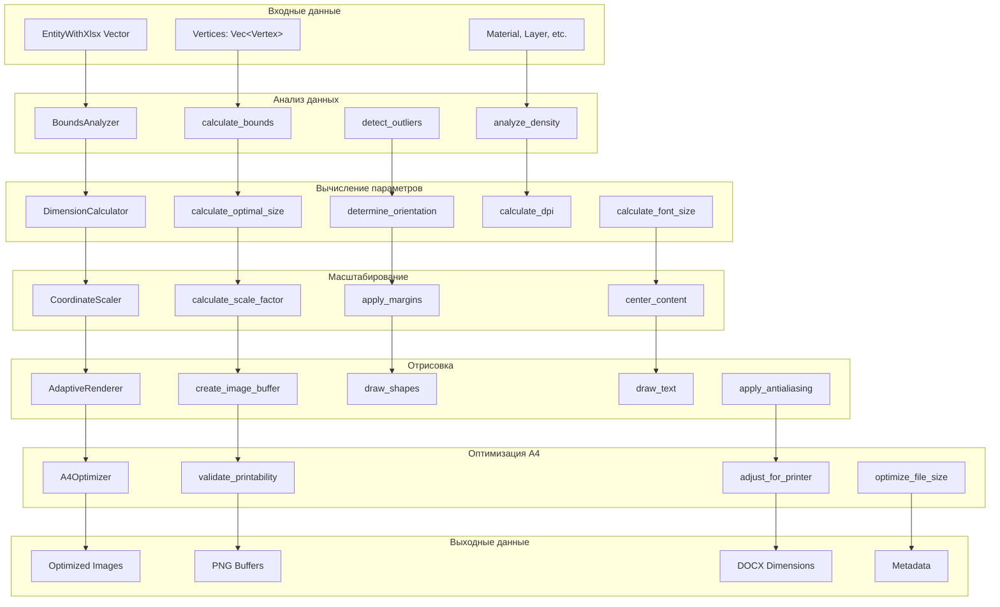

## Детальная архитектура компонентов

### 1. BoundsAnalyzer

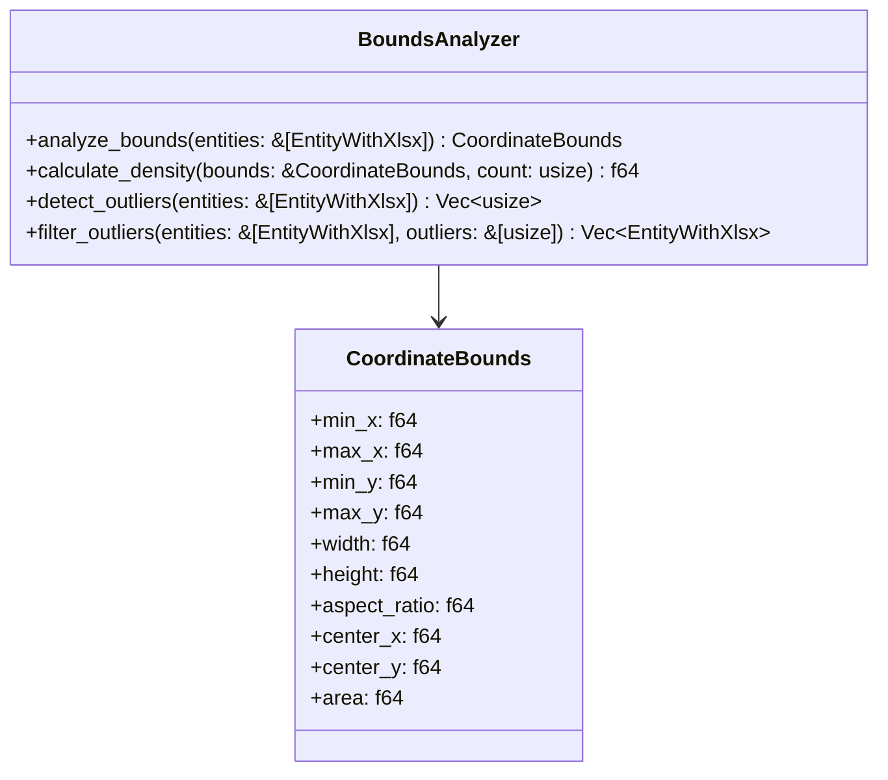

### 2. DimensionCalculator

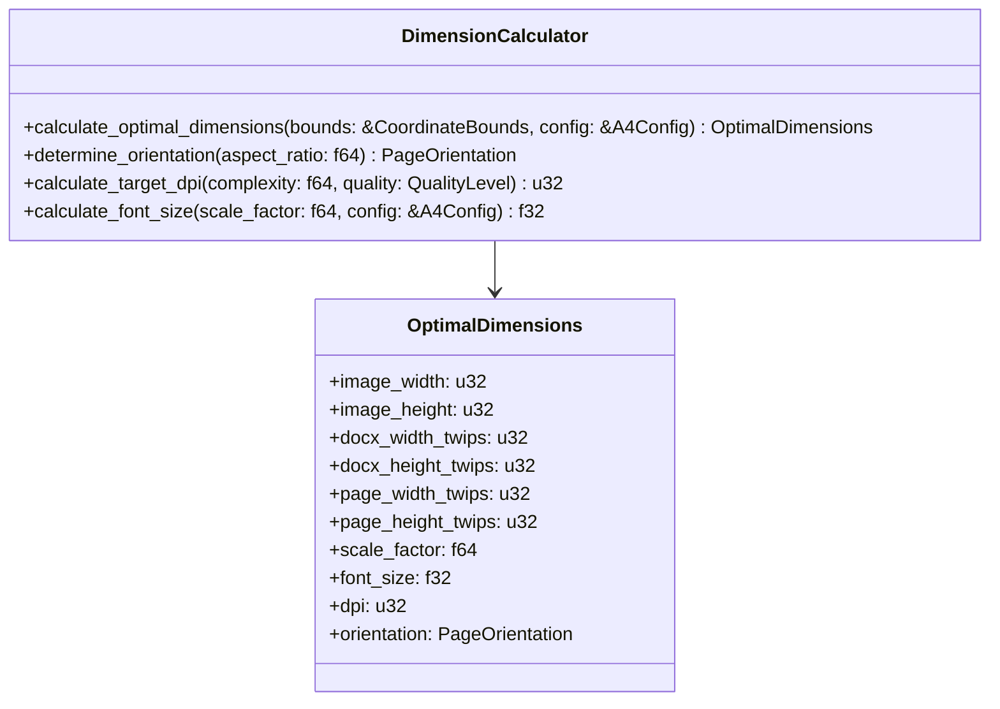

### 3. CoordinateScaler

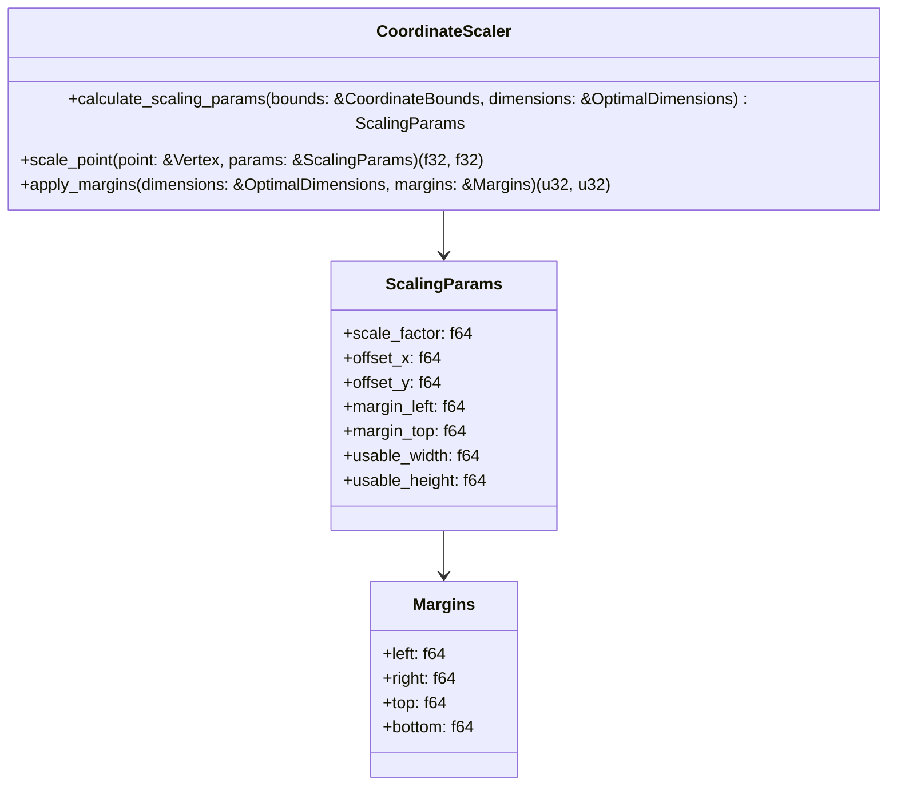

## Поток данных

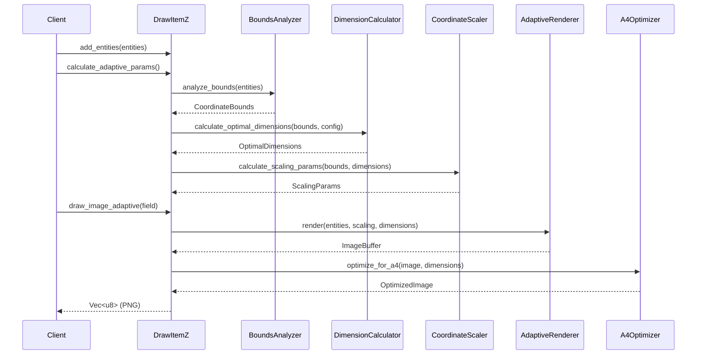

## Алгоритмы вычислений

### Расчет оптимальных размеров

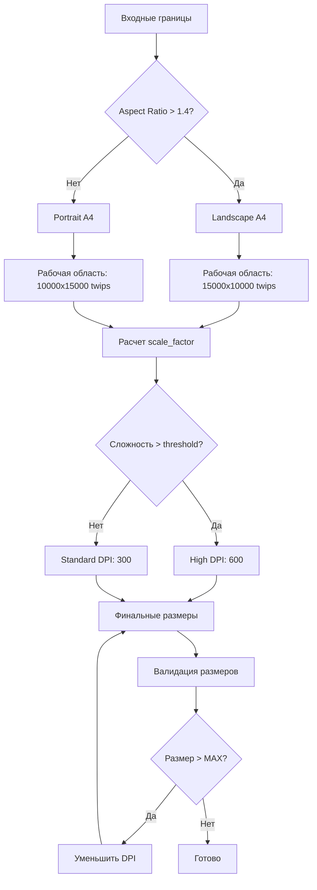

### Масштабирование координат

```mermaid
flowchart TD
    A[Исходные координаты] --> B[Нормализация к [0,1]]
    B --> C[Применение отступов]
    C --> D[Масштабирование к целевому размеру]
    D --> E[Центрирование]
    E --> F[Финальные координаты]
    
    subgraph "Формулы"
        G["normalized_x = (x - min_x) / width"]
        H["scaled_x = normalized_x * usable_width + margin_left"]
        I["final_x = scaled_x + center_offset_x"]
    end
```

## Конфигурация и настройки

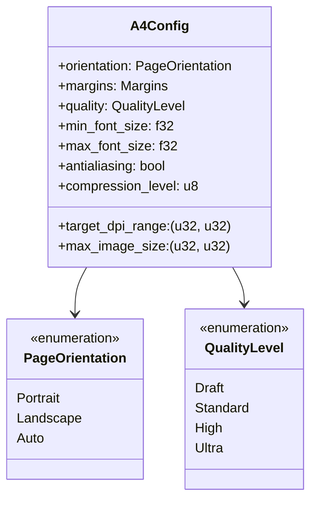

## Оптимизации производительности

### Кэширование

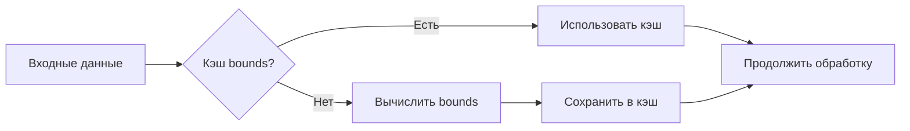

### Параллельная обработка

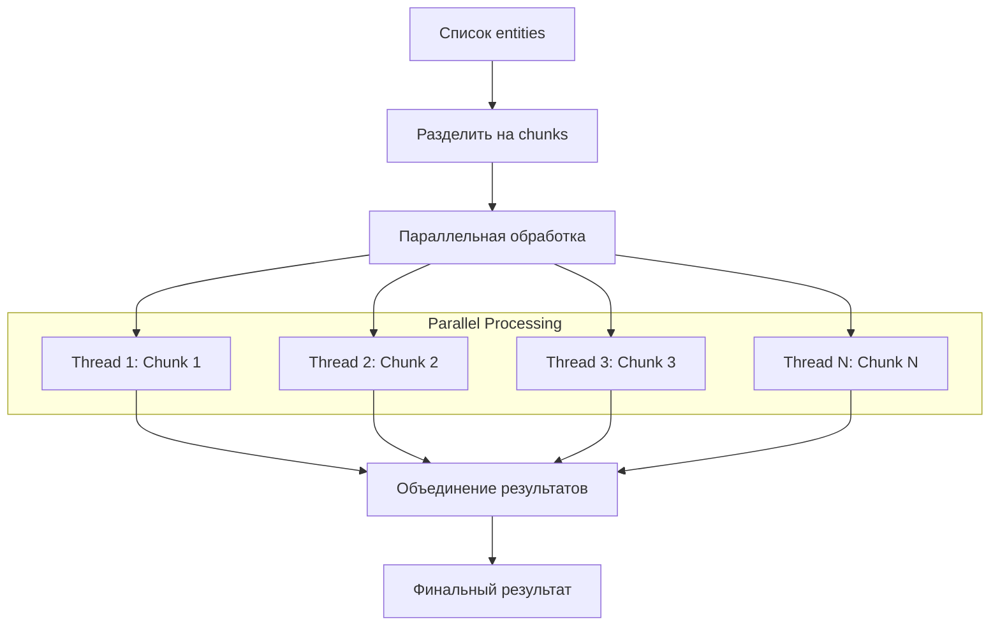

## Обработка ошибок

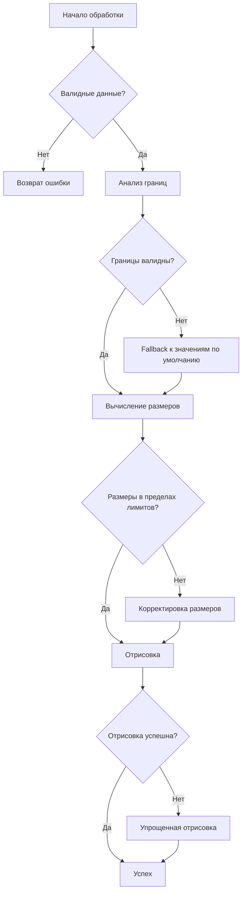

## Интеграционные точки

### С существующим кодом

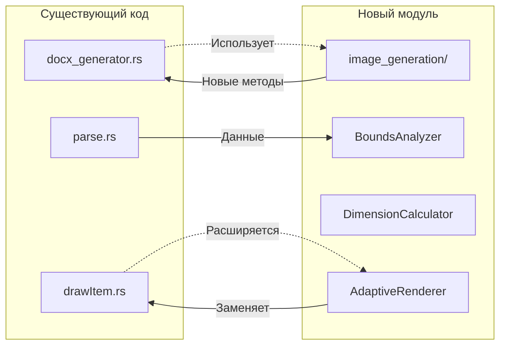

### API совместимость

```rust
// Старый API (сохраняется)
impl DrawItemZ {
    pub fn draw_all_images(&self) -> Vec<Vec<u8>> {
        // Fallback к новому API с настройками по умолчанию
        self.draw_all_images_adaptive_with_config(&A4Config::default())
    }
}

// Новый API
impl DrawItemZ {
    pub fn draw_all_images_adaptive(&self) -> Vec<Vec<u8>>
    pub fn draw_all_images_adaptive_with_config(&self, config: &A4Config) -> Vec<Vec<u8>>
    pub fn get_optimal_docx_dimensions(&self) -> (u32, u32)
}
```