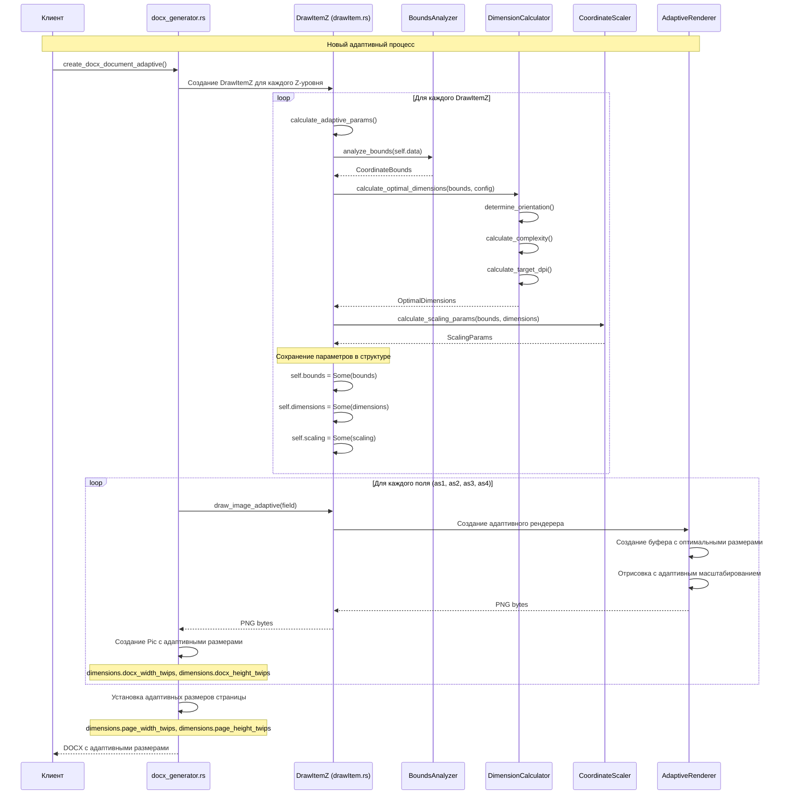
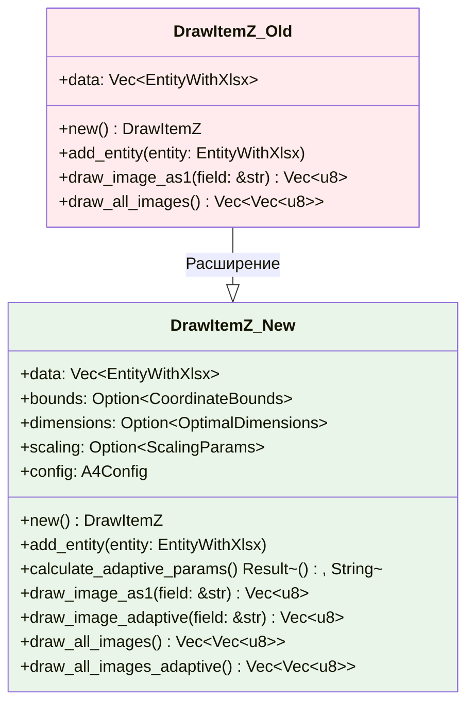
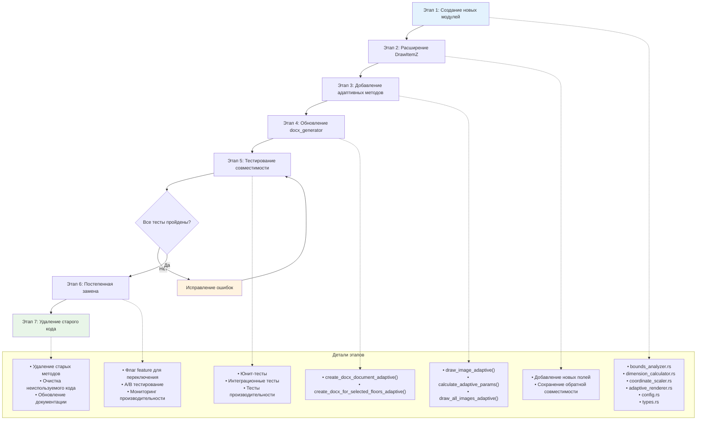
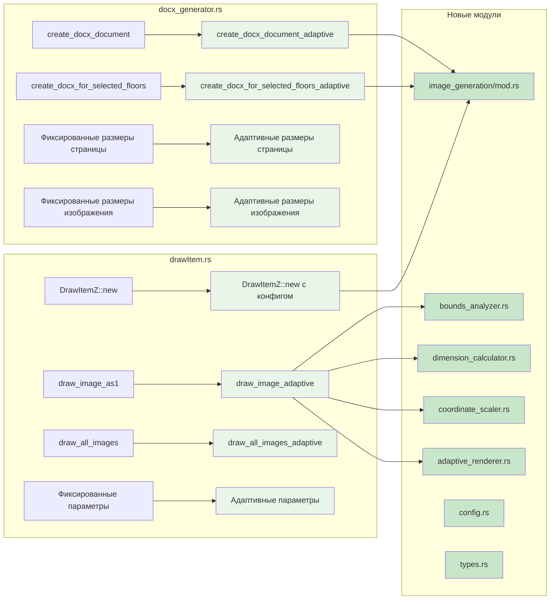
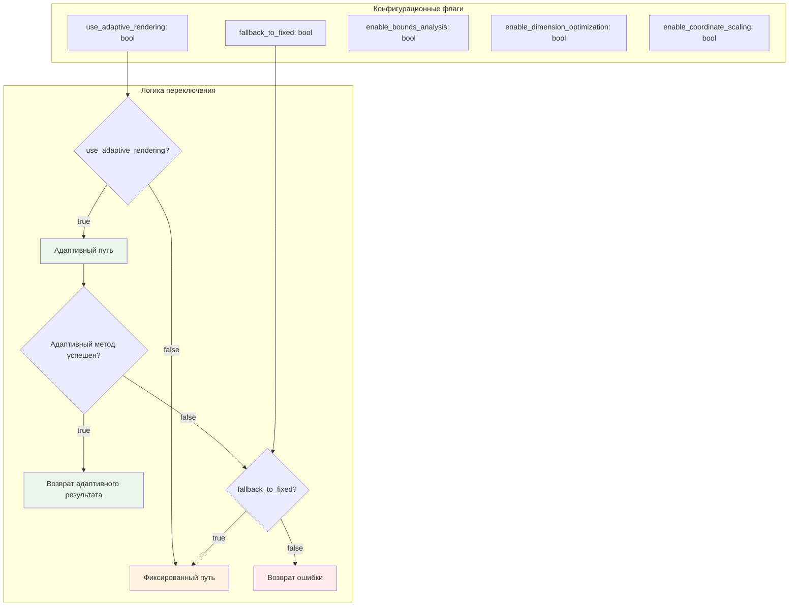
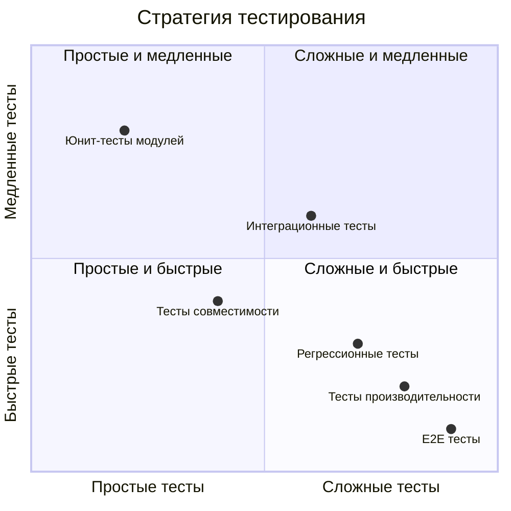

# Диаграмма интеграции с существующим кодом

## Текущая архитектура vs Новая архитектура

```mermaid
graph TB
    subgraph "Текущая система (До изменений)"
        A1[EntityWithXlsx Data] --> B1[DrawItemZ::new()]
        B1 --> C1[draw_image_as1() - Фиксированные размеры]
        C1 --> D1[Фиксированное масштабирование 40.0]
        D1 --> E1[Фиксированные размеры изображения 2500x2000]
        E1 --> F1[Фиксированные размеры DOCX 20M x 15M twips]
        F1 --> G1[create_docx_document()]
        G1 --> H1[DOCX с фиксированными размерами]
    end
    
    subgraph "Новая система (После изменений)"
        A2[EntityWithXlsx Data] --> B2[DrawItemZ::new()]
        B2 --> C2[calculate_adaptive_params()]
        C2 --> D2[BoundsAnalyzer]
        D2 --> E2[DimensionCalculator]
        E2 --> F2[CoordinateScaler]
        F2 --> G2[draw_image_adaptive()]
        G2 --> H2[Адаптивные размеры изображения]
        H2 --> I2[Адаптивные размеры DOCX]
        I2 --> J2[create_docx_document_adaptive()]
        J2 --> K2[DOCX с адаптивными размерами]
    end
    
    style A1 fill:#ffebee
    style H1 fill:#ffebee
    style A2 fill:#e8f5e8
    style K2 fill:#e8f5e8
```

## Детальная схема интеграции



## Изменения в структуре DrawItemZ



## Миграционная стратегия



## Точки интеграции в существующем коде



## Обратная совместимость

```mermaid
flowchart TD
    A[Вызов существующего API] --> B{Используется новый метод?}
    B -->|Нет| C[Вызов старого метода]
    B -->|Да| D[Проверка наличия адаптивных параметров]
    
    C --> E[Возврат результата старым способом]
    
    D --> F{Параметры вычислены?}
    F -->|Нет| G[calculate_adaptive_params()]
    F -->|Да| H[Использование существующих параметров]
    
    G --> I{Успешно?}
    I -->|Нет| J[Fallback к старому методу]
    I -->|Да| H
    
    H --> K[Вызов адаптивного метода]
    J --> C
    K --> L[Возврат адаптивного результата]
    
    style C fill:#fff3e0
    style E fill:#fff3e0
    style J fill:#fff3e0
    style K fill:#e8f5e8
    style L fill:#e8f5e8
```

## Конфигурация переключения



## Тестовая стратегия



## Мониторинг и метрики

```mermaid
graph TB
    subgraph "Метрики производительности"
        A[Время анализа границ]
        B[Время вычисления размеров]
        C[Время масштабирования]
        D[Время отрисовки]
        E[Общее время обработки]
        F[Использование памяти]
    end
    
    subgraph "Метрики качества"
        G[Размер файла DOCX]
        H[Качество изображения]
        I[Читаемость текста]
        J[Соответствие A4 формату]
    end
    
    subgraph "Метрики надежности"
        K[Частота ошибок]
        L[Частота fallback]
        M[Успешность обработки]
        N[Стабильность результатов]
    end
    
    subgraph "Система мониторинга"
        O[Логирование]
        P[Метрики Prometheus]
        Q[Дашборды Grafana]
        R[Алерты]
    end
    
    A --> O
    B --> O
    C --> O
    D --> O
    E --> P
    F --> P
    G --> P
    H --> P
    I --> P
    J --> P
    K --> R
    L --> R
    M --> Q
    N --> Q
    
    style O fill:#e3f2fd
    style P fill:#e8f5e8
    style Q fill:#fff3e0
    style R fill:#ffebee
```



## Заключение

Данная диаграмма интеграции показывает:

1. **Плавный переход** от текущей системы к новой адаптивной
2. **Обратную совместимость** для существующего кода
3. **Поэтапную миграцию** с возможностью отката
4. **Комплексное тестирование** на всех уровнях
5. **Мониторинг и контроль** качества интеграции

Это обеспечивает безопасное внедрение новой функциональности без нарушения работы существующей системы.