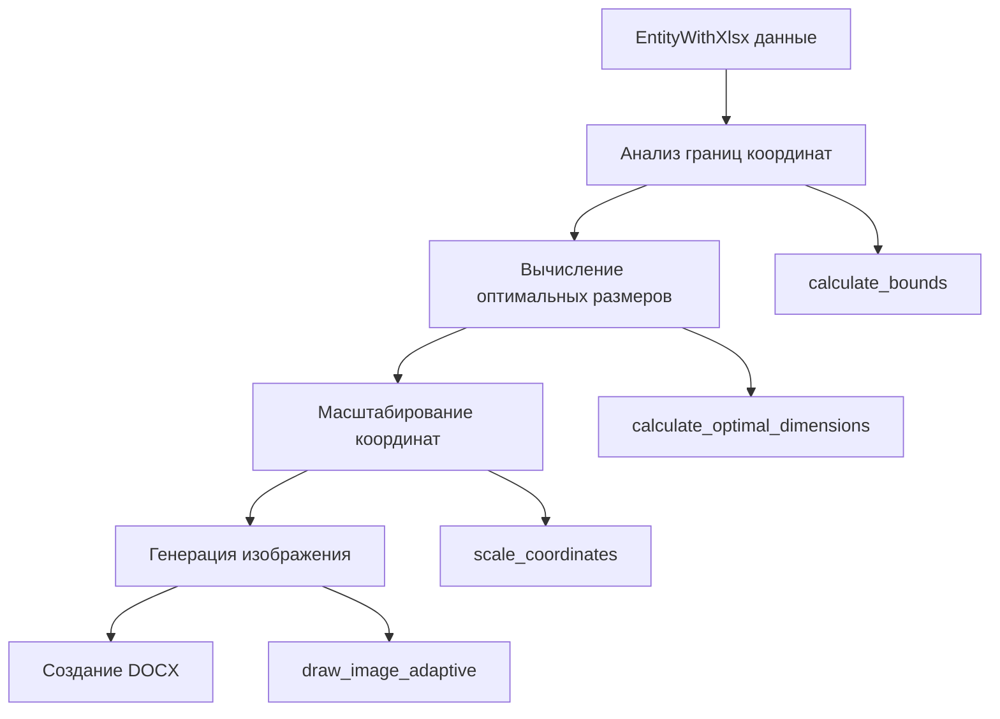

# Система адаптивной генерации изображений для DOCX

## Обзор

Данный модуль отвечает за генерацию изображений с автоматическим масштабированием для корректного отображения в DOCX документах формата A4.

## Проблема

Текущая система использует фиксированные размеры изображений (20,000,000 x 15,000,000 твипов), что не адаптируется к различным координатным диапазонам проектов. Это приводит к:

- Неоптимальному использованию пространства страницы
- Проблемам с читаемостью при печати на A4
- Невозможности корректного отображения проектов с различными масштабами

## Цель

Создать систему, которая:

1. Автоматически анализирует координатные границы фигур
2. Вычисляет оптимальные размеры изображений для A4
3. Масштабирует координаты для максимального использования пространства
4. Обеспечивает читаемость текста и качество изображений

## Архитектура решения



## Технические требования

### Формат A4

- Размер: 210 x 297 мм
- В твипах: 11906 x 16838 (портрет) или 16838 x 11906 (альбом)
- Рабочая область с отступами: ~15000 x 10000 твипов

### Качество изображений

- Минимальное разрешение: 300 DPI
- Максимальное разрешение: 600 DPI для сложных чертежей
- Адаптивный размер шрифта: 8-24pt в зависимости от масштаба

## Структура модуля

```
image_generation/
├── mod.rs              # Публичный интерфейс модуля
├── bounds_analyzer.rs  # Анализ координатных границ
├── dimension_calculator.rs # Вычисление оптимальных размеров
├── coordinate_scaler.rs    # Масштабирование координат
├── adaptive_renderer.rs    # Адаптивная отрисовка
└── a4_optimizer.rs         # Оптимизация под формат A4
```

## Алгоритм работы

### 1. Анализ границ (bounds_analyzer.rs)

```rust
pub struct CoordinateBounds {
    pub min_x: f64,
    pub max_x: f64,
    pub min_y: f64,
    pub max_y: f64,
    pub width: f64,
    pub height: f64,
    pub aspect_ratio: f64,
}

pub fn analyze_bounds(entities: &[EntityWithXlsx]) -> CoordinateBounds
```

### 2. Вычисление размеров (dimension_calculator.rs)

```rust
pub struct OptimalDimensions {
    pub image_width: u32,
    pub image_height: u32,
    pub docx_width_twips: u32,
    pub docx_height_twips: u32,
    pub scale_factor: f64,
    pub font_size: f32,
}

pub fn calculate_optimal_dimensions(
    bounds: &CoordinateBounds,
    target_format: A4Format
) -> OptimalDimensions
```

### 3. Масштабирование (coordinate_scaler.rs)

```rust
pub struct ScalingParams {
    pub scale_factor: f64,
    pub offset_x: f64,
    pub offset_y: f64,
    pub margin: f64,
}

pub fn calculate_scaling_params(
    bounds: &CoordinateBounds,
    target_dimensions: &OptimalDimensions
) -> ScalingParams
```

## Интеграция с существующим кодом

### Изменения в DrawItemZ

```rust
pub struct DrawItemZ {
    pub data: Vec<EntityWithXlsx>,
    pub bounds: Option<CoordinateBounds>,
    pub dimensions: Option<OptimalDimensions>,
    pub scaling: Option<ScalingParams>,
}
```

### Новые методы

- `calculate_adaptive_params(&mut self)`
- `draw_image_adaptive(&self, field: &str) -> Vec<u8>`
- `get_optimal_docx_size(&self) -> (u32, u32)`

## Этапы реализации

### Этап 1: Создание базовой структуры

- [ ] Создать модуль image_generation
- [ ] Реализовать bounds_analyzer.rs
- [ ] Добавить тесты для анализа границ

### Этап 2: Вычисление размеров

- [X] Реализовать dimension_calculator.rs
- [X] Добавить поддержку различных форматов A4
- [ ] Создать конфигурацию качества

### Этап 3: Масштабирование

- [ ] Реализовать coordinate_scaler.rs
- [ ] Добавить поддержку отступов и полей
- [ ] Оптимизировать для читаемости текста

### Этап 4: Адаптивная отрисовка

- [ ] Модифицировать DrawItemZ
- [ ] Реализовать adaptive_renderer.rs
- [ ] Интегрировать с существующими методами отрисовки

### Этап 5: Интеграция с DOCX

- [ ] Обновить docx_generator.rs
- [ ] Заменить фиксированные размеры на динамические
- [ ] Добавить поддержку автоматической ориентации страницы

### Этап 6: Тестирование и оптимизация

- [ ] Создать тестовые наборы данных
- [ ] Провести тестирование печати на A4
- [ ] Оптимизировать производительность

## Конфигурация

```rust
pub struct A4Config {
    pub orientation: PageOrientation,
    pub margins: Margins,
    pub min_font_size: f32,
    pub max_font_size: f32,
    pub target_dpi: u32,
    pub quality_level: QualityLevel,
}

pub enum PageOrientation {
    Portrait,
    Landscape,
    Auto, // Выбирается автоматически на основе aspect_ratio
}

pub enum QualityLevel {
    Draft,    // 150 DPI, быстрая генерация
    Standard, // 300 DPI, баланс качества и размера
    High,     // 600 DPI, максимальное качество
}
```

## Примеры использования

```rust
// Создание адаптивного изображения
let mut item_z = DrawItemZ::new();
for entity in entities {
    item_z.add_entity(entity);
}

// Автоматический расчет параметров
item_z.calculate_adaptive_params();

// Генерация изображений с оптимальными размерами
let images = item_z.draw_all_images_adaptive();

// Получение размеров для DOCX
let (docx_width, docx_height) = item_z.get_optimal_docx_size();
```

## Метрики качества

- **Коэффициент использования пространства**: > 80% площади страницы
- **Читаемость текста**: Минимум 8pt при печати на A4
- **Время генерации**: < 2 сек для 10000 элементов
- **Размер файла**: Оптимизация PNG сжатия

## Совместимость

- Обратная совместимость с существующим API
- Поддержка fallback для случаев с пустыми данными
- Graceful degradation при ошибках вычислений
