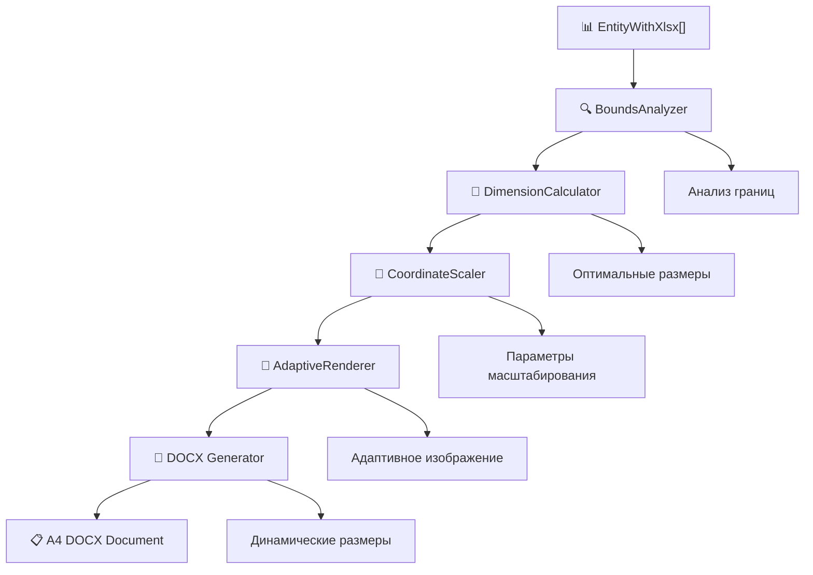

# 📚 Документация: Адаптивная система генерации изображений для DOCX

## 🎯 Быстрый старт

**Цель проекта**: Создание адаптивной системы генерации изображений для DOCX документов, которая автоматически подстраивает размеры изображений и страниц под координаты фигур, обеспечивая оптимальное размещение на листах формата A4.

**Время реализации**: 2-3 недели  
**Статус**: Готов к реализации

---

## 📋 Навигация по документации

### 🚀 Начало работы
| Документ | Описание | Приоритет |
|----------|----------|----------|
| [`README.md`](README.md) | 📖 Общий обзор и введение в проект | ⭐⭐⭐ |
| [`docs/PROJECT_OVERVIEW.md`](docs/PROJECT_OVERVIEW.md) | 🎯 Полный обзор проекта и навигация | ⭐⭐⭐ |
| [`COMPLETE_PLAN.md`](COMPLETE_PLAN.md) | 📋 Исчерпывающий план реализации | ⭐⭐⭐ |

### 📐 Планирование и архитектура
| Документ | Описание | Приоритет |
|----------|----------|----------|
| [`IMPLEMENTATION_PLAN.md`](IMPLEMENTATION_PLAN.md) | 🔧 Детальный план по этапам (6 стадий) | ⭐⭐⭐ |
| [`ARCHITECTURE.md`](ARCHITECTURE.md) | 🏗️ Архитектура системы и компонентов | ⭐⭐ |
| [`INTEGRATION_FLOW.md`](INTEGRATION_FLOW.md) | 🔄 Процесс интеграции с существующим кодом | ⭐⭐ |

### 🔧 Техническая документация
| Документ | Описание | Приоритет |
|----------|----------|----------|
| [`docs/TECHNICAL_DOCUMENTATION.md`](docs/TECHNICAL_DOCUMENTATION.md) | ⚙️ Техническая архитектура и алгоритмы | ⭐⭐⭐ |
| [`docs/API_EXAMPLES.md`](docs/API_EXAMPLES.md) | 💻 Примеры использования API | ⭐⭐ |

### ⚡ Производительность и качество
| Документ | Описание | Приоритет |
|----------|----------|----------|
| [`docs/PERFORMANCE_OPTIMIZATION.md`](docs/PERFORMANCE_OPTIMIZATION.md) | 🚀 Оптимизация производительности | ⭐⭐ |
| [`docs/TESTING_VALIDATION.md`](docs/TESTING_VALIDATION.md) | 🧪 Стратегия тестирования и валидации | ⭐⭐ |

---

## 🎯 Рекомендуемый порядок изучения

### Для менеджеров проекта
1. [`docs/PROJECT_OVERVIEW.md`](docs/PROJECT_OVERVIEW.md) - Общее понимание
2. [`COMPLETE_PLAN.md`](COMPLETE_PLAN.md) - Полный план
3. [`IMPLEMENTATION_PLAN.md`](IMPLEMENTATION_PLAN.md) - Временные рамки

### Для разработчиков
1. [`README.md`](README.md) - Введение
2. [`docs/TECHNICAL_DOCUMENTATION.md`](docs/TECHNICAL_DOCUMENTATION.md) - Техническая архитектура
3. [`docs/API_EXAMPLES.md`](docs/API_EXAMPLES.md) - Примеры кода
4. [`IMPLEMENTATION_PLAN.md`](IMPLEMENTATION_PLAN.md) - План реализации
5. [`INTEGRATION_FLOW.md`](INTEGRATION_FLOW.md) - Интеграция

### Для тестировщиков
1. [`docs/TESTING_VALIDATION.md`](docs/TESTING_VALIDATION.md) - Стратегия тестирования
2. [`docs/PERFORMANCE_OPTIMIZATION.md`](docs/PERFORMANCE_OPTIMIZATION.md) - Метрики производительности
3. [`docs/API_EXAMPLES.md`](docs/API_EXAMPLES.md) - Примеры для тестов

---

## 🏗️ Архитектура системы



## 📊 Ключевые компоненты

| Компонент | Файл | Назначение |
|-----------|------|------------|
| **BoundsAnalyzer** | `bounds_analyzer.rs` | Анализ границ координат фигур |
| **DimensionCalculator** | `dimension_calculator.rs` | Расчет оптимальных размеров для A4 |
| **CoordinateScaler** | `coordinate_scaler.rs` | Масштабирование и центрирование |
| **AdaptiveRenderer** | `adaptive_renderer.rs` | Генерация адаптивных изображений |
| **A4Optimizer** | `a4_optimizer.rs` | Оптимизация для формата A4 |

## 🎯 Основные цели

✅ **Автоматическое определение границ** - Анализ координат для расчета размеров  
✅ **Адаптивное масштабирование A4** - Динамическое изменение размеров  
✅ **4 изображения на этаж** - as1, as2, as3, as4 для каждого этажа  
✅ **Высокое качество** - Читаемость текста и четкость изображений  
✅ **Обратная совместимость** - Сохранение работы существующего кода  
✅ **Производительность** - Эффективная обработка больших объемов данных  

## 📈 Этапы реализации

| Этап | Время | Описание |
|------|-------|----------|
| **1. Инфраструктура** | 3-4 дня | Модульная структура, типы данных, конфигурация |
| **2. Анализ границ** | 2-3 дня | BoundsAnalyzer, обработка ошибок, тесты |
| **3. Расчет размеров** | 2-3 дня | DimensionCalculator, алгоритмы ориентации |
| **4. Масштабирование** | 2 дня | CoordinateScaler, центрирование, шрифты |
| **5. Рендеринг** | 3-4 дня | AdaptiveRenderer, интеграция компонентов |
| **6. DOCX интеграция** | 2-3 дня | Обновление генератора, тестирование |

## 🔧 Конфигурация

### Переменные окружения
```bash
# Качество изображений
IMAGE_QUALITY=Standard  # Draft, Standard, High

# Производительность
ENABLE_PARALLEL_PROCESSING=true
ENABLE_CACHING=true

# Отладка
LOG_LEVEL=Info
ENABLE_PERFORMANCE_MONITORING=true
```

### Cargo features
```toml
[features]
default = ["adaptive_rendering"]
adaptive_rendering = []
legacy_mode = []
performance_monitoring = ["sysinfo"]
```

## 🧪 Тестирование

### Запуск тестов
```bash
# Все тесты
cargo test

# Модульные тесты
cargo test --lib

# Интеграционные тесты
cargo test --test integration_tests

# Бенчмарки
cargo bench

# Покрытие кода
cargo tarpaulin --out Html
```

### Типы тестов
- ✅ **Модульные** - Каждый компонент отдельно
- ✅ **Интеграционные** - Полный пайплайн
- ✅ **Производительность** - Бенчмарки и профилирование
- ✅ **Качество** - Валидация изображений
- ✅ **Регрессионные** - Совместимость с legacy

## 📦 Развертывание

### Стратегия миграции
1. **Legacy режим** - Существующий код без изменений
2. **A/B тестирование** - Параллельная работа систем
3. **Полный переход** - Использование только новой системы
4. **Удаление legacy** - Очистка старого кода

## 📞 Поддержка

### Документация
- 📖 Полная техническая документация в папке `docs/`
- 💻 Примеры кода и API в `docs/API_EXAMPLES.md`
- 🧪 Руководство по тестированию в `docs/TESTING_VALIDATION.md`

### Мониторинг
- 📊 Метрики производительности
- 🔍 Детальное логирование
- ⚠️ Обработка ошибок с fallback

---

## 🎉 Заключение

Документация предоставляет полное руководство для реализации адаптивной системы генерации изображений. Система спроектирована с учетом:

- **Модульности** - Легкая интеграция и тестирование
- **Производительности** - Оптимизация для больших проектов
- **Качества** - Высокие стандарты изображений и кода
- **Совместимости** - Плавная миграция с существующего кода
- **Расширяемости** - Возможность добавления новых функций

**Готово к реализации!** 🚀

---

*Последнее обновление: Декабрь 2024*