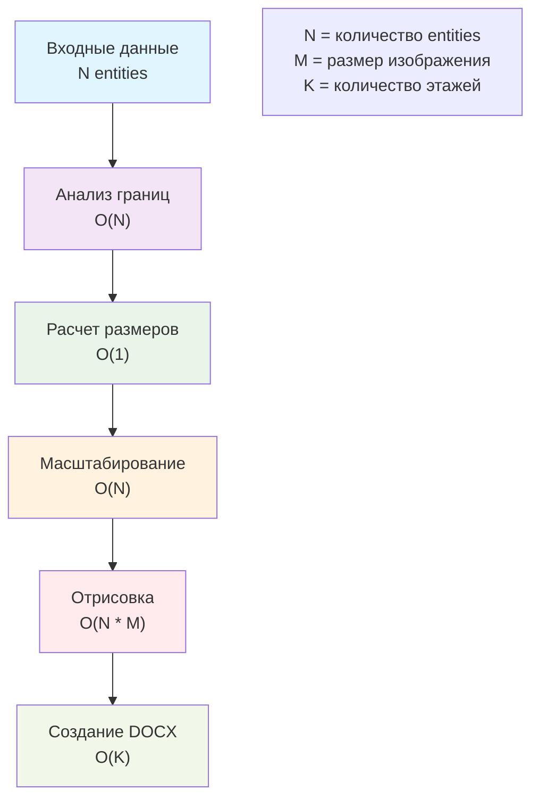
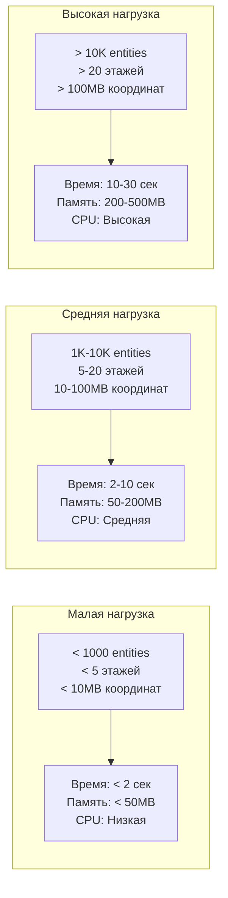
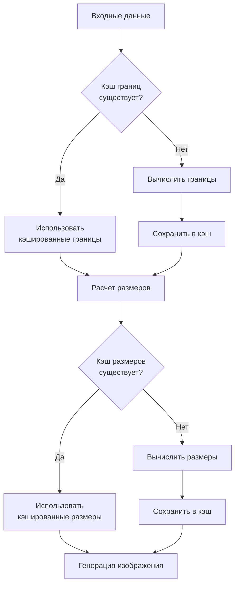
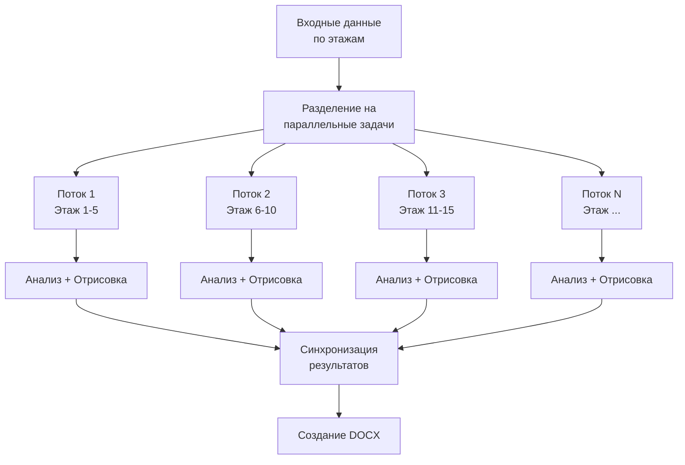
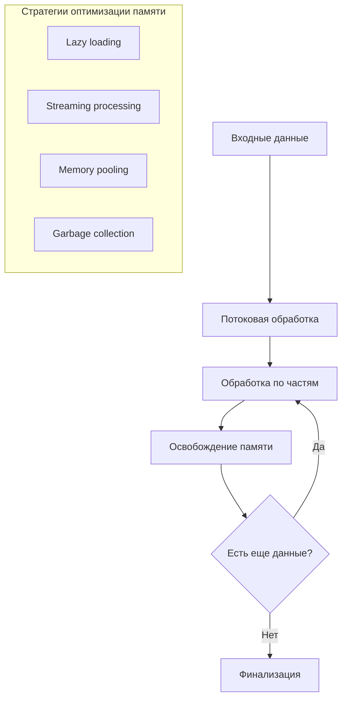
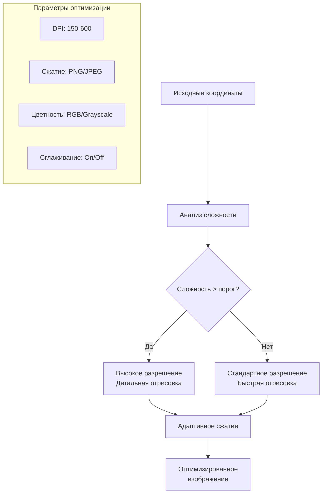
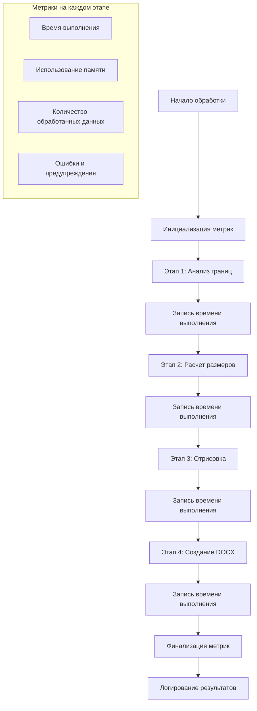
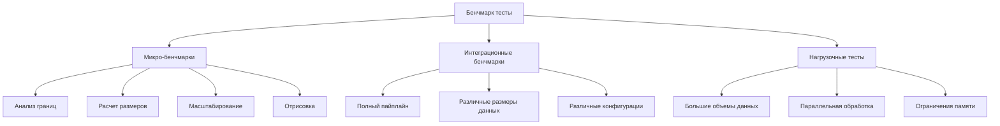

# Производительность и оптимизация

## Обзор производительности

Адаптивная система генерации изображений разработана с учетом высокой производительности и масштабируемости. Данный документ описывает профили производительности, стратегии оптимизации и метрики мониторинга.

## Профили производительности

### Временная сложность операций



### Профили нагрузки



## Стратегии оптимизации

### 1. Кэширование результатов



#### Реализация кэширования

```rust
use std::collections::HashMap;
use std::sync::{Arc, Mutex};

// Глобальный кэш для границ координат
lazy_static! {
    static ref BOUNDS_CACHE: Arc<Mutex<HashMap<String, CoordinateBounds>>> = 
        Arc::new(Mutex::new(HashMap::new()));
    
    static ref DIMENSIONS_CACHE: Arc<Mutex<HashMap<String, OptimalDimensions>>> = 
        Arc::new(Mutex::new(HashMap::new()));
}

// Функция с кэшированием
pub fn analyze_coordinate_bounds_cached(
    entities: &[EntityWithXlsx],
    cache_key: &str
) -> Result<CoordinateBounds, BoundsError> {
    
    // Проверка кэша
    if let Ok(cache) = BOUNDS_CACHE.lock() {
        if let Some(cached_bounds) = cache.get(cache_key) {
            return Ok(cached_bounds.clone());
        }
    }
    
    // Вычисление границ
    let bounds = analyze_coordinate_bounds(entities)?;
    
    // Сохранение в кэш
    if let Ok(mut cache) = BOUNDS_CACHE.lock() {
        cache.insert(cache_key.to_string(), bounds.clone());
    }
    
    Ok(bounds)
}
```

### 2. Параллельная обработка



#### Реализация параллельной обработки

```rust
use rayon::prelude::*;
use std::sync::Arc;

// Параллельная обработка этажей
pub fn create_docx_document_parallel(
    hash_grouped_by_z: &HashMap<String, DrawItemZ>
) -> Result<Vec<u8>, Box<dyn std::error::Error>> {
    
    // Параллельная обработка каждого этажа
    let processed_floors: Result<Vec<_>, _> = hash_grouped_by_z
        .par_iter()
        .map(|(floor_name, draw_item)| {
            // Каждый этаж обрабатывается в отдельном потоке
            process_floor_parallel(floor_name, draw_item)
        })
        .collect();
    
    let floors = processed_floors?;
    
    // Последовательное создание DOCX документа
    create_docx_from_processed_floors(floors)
}

fn process_floor_parallel(
    floor_name: &str,
    draw_item: &DrawItemZ
) -> Result<ProcessedFloor, Box<dyn std::error::Error>> {
    
    // Анализ границ
    let bounds = draw_item.analyze_bounds()?;
    
    // Расчет размеров
    let config = A4Config::default();
    let dimensions = calculate_optimal_dimensions(&bounds, &config)?;
    
    // Генерация изображения
    let image_data = draw_item.draw_image_adaptive(&bounds, &dimensions)?;
    
    Ok(ProcessedFloor {
        name: floor_name.to_string(),
        bounds,
        dimensions,
        image_data,
    })
}
```

### 3. Оптимизация памяти



#### Реализация оптимизации памяти

```rust
use std::mem;

// Потоковая обработка с ограничением памяти
pub fn create_docx_memory_optimized(
    hash_grouped_by_z: &HashMap<String, DrawItemZ>,
    max_memory_mb: usize
) -> Result<Vec<u8>, Box<dyn std::error::Error>> {
    
    let mut docx_builder = DocxBuilder::new();
    let max_memory_bytes = max_memory_mb * 1024 * 1024;
    let mut current_memory_usage = 0;
    
    for (floor_name, draw_item) in hash_grouped_by_z {
        // Оценка потребления памяти для этого этажа
        let estimated_memory = estimate_memory_usage(draw_item);
        
        if current_memory_usage + estimated_memory > max_memory_bytes {
            // Принудительная очистка памяти
            force_garbage_collection();
            current_memory_usage = get_current_memory_usage();
        }
        
        // Обработка этажа с освобождением промежуточных данных
        let image_data = {
            let bounds = draw_item.analyze_bounds()?;
            let dimensions = calculate_optimal_dimensions(&bounds, &A4Config::default())?;
            let image = draw_item.draw_image_adaptive(&bounds, &dimensions)?;
            
            // Освобождение промежуточных данных
            mem::drop(bounds);
            mem::drop(dimensions);
            
            image
        };
        
        docx_builder.add_floor_image(floor_name, image_data);
        current_memory_usage += estimated_memory;
    }
    
    docx_builder.build()
}

fn estimate_memory_usage(draw_item: &DrawItemZ) -> usize {
    // Оценка: количество entities * средний размер entity * коэффициент
    draw_item.data.len() * 1024 * 2 // ~2KB на entity
}

fn force_garbage_collection() {
    // Принудительная очистка памяти (зависит от платформы)
    #[cfg(feature = "jemalloc")]
    {
        // Использование jemalloc для более эффективного управления памятью
    }
}
```

### 4. Оптимизация изображений



#### Реализация адаптивного качества

```rust
#[derive(Debug, Clone)]
pub struct ImageOptimizationConfig {
    pub base_dpi: f64,
    pub complexity_threshold: f64,
    pub high_quality_dpi: f64,
    pub low_quality_dpi: f64,
    pub compression_level: u8,
    pub enable_antialiasing: bool,
}

pub fn calculate_adaptive_image_quality(
    bounds: &CoordinateBounds,
    entity_count: usize,
    config: &ImageOptimizationConfig
) -> ImageQualityParams {
    
    // Расчет сложности сцены
    let complexity = calculate_scene_complexity(bounds, entity_count);
    
    let (target_dpi, antialiasing, compression) = if complexity > config.complexity_threshold {
        // Высокая сложность - высокое качество
        (config.high_quality_dpi, true, 1)
    } else {
        // Низкая сложность - стандартное качество
        (config.low_quality_dpi, config.enable_antialiasing, config.compression_level)
    };
    
    ImageQualityParams {
        dpi: target_dpi,
        antialiasing,
        compression_level: compression,
        color_mode: if complexity > config.complexity_threshold * 1.5 {
            ColorMode::RGB
        } else {
            ColorMode::Grayscale
        },
    }
}

fn calculate_scene_complexity(bounds: &CoordinateBounds, entity_count: usize) -> f64 {
    // Факторы сложности:
    // 1. Количество объектов
    // 2. Плотность объектов на единицу площади
    // 3. Соотношение сторон (экстремальные соотношения сложнее)
    
    let area = bounds.width * bounds.height;
    let density = entity_count as f64 / area;
    let aspect_penalty = if bounds.aspect_ratio > 3.0 || bounds.aspect_ratio < 0.33 {
        1.5
    } else {
        1.0
    };
    
    density * aspect_penalty * (entity_count as f64).ln()
}
```

## Метрики производительности

### Структура метрик

```rust
#[derive(Debug, Clone, Serialize, Deserialize)]
pub struct PerformanceMetrics {
    // Временные метрики (в миллисекундах)
    pub total_time_ms: u64,
    pub bounds_analysis_time_ms: u64,
    pub dimension_calculation_time_ms: u64,
    pub coordinate_scaling_time_ms: u64,
    pub image_rendering_time_ms: u64,
    pub docx_generation_time_ms: u64,
    
    // Метрики данных
    pub total_entities: usize,
    pub total_floors: usize,
    pub total_vertices: usize,
    
    // Метрики памяти (в байтах)
    pub peak_memory_usage: usize,
    pub average_memory_usage: usize,
    pub memory_allocations: usize,
    
    // Метрики качества
    pub average_image_size_kb: f64,
    pub total_docx_size_kb: f64,
    pub compression_ratio: f64,
    
    // Метрики ошибок
    pub errors_count: usize,
    pub warnings_count: usize,
    pub fallback_count: usize,
}
```

### Система мониторинга



#### Реализация мониторинга

```rust
use std::time::{Instant, Duration};
use sysinfo::{System, SystemExt};

pub struct PerformanceMonitor {
    metrics: PerformanceMetrics,
    start_time: Instant,
    stage_start_time: Instant,
    system: System,
}

impl PerformanceMonitor {
    pub fn new() -> Self {
        Self {
            metrics: PerformanceMetrics::default(),
            start_time: Instant::now(),
            stage_start_time: Instant::now(),
            system: System::new_all(),
        }
    }
    
    pub fn start_stage(&mut self, stage_name: &str) {
        self.stage_start_time = Instant::now();
        log::debug!("Начало этапа: {}", stage_name);
    }
    
    pub fn end_stage(&mut self, stage_name: &str) {
        let elapsed = self.stage_start_time.elapsed().as_millis() as u64;
        
        match stage_name {
            "bounds_analysis" => self.metrics.bounds_analysis_time_ms = elapsed,
            "dimension_calculation" => self.metrics.dimension_calculation_time_ms = elapsed,
            "coordinate_scaling" => self.metrics.coordinate_scaling_time_ms = elapsed,
            "image_rendering" => self.metrics.image_rendering_time_ms = elapsed,
            "docx_generation" => self.metrics.docx_generation_time_ms = elapsed,
            _ => {}
        }
        
        // Обновление метрик памяти
        self.system.refresh_memory();
        let current_memory = self.system.used_memory() as usize;
        if current_memory > self.metrics.peak_memory_usage {
            self.metrics.peak_memory_usage = current_memory;
        }
        
        log::debug!("Завершение этапа '{}': {}мс, память: {}MB", 
            stage_name, elapsed, current_memory / 1024 / 1024);
    }
    
    pub fn record_data_metrics(&mut self, entities: usize, floors: usize, vertices: usize) {
        self.metrics.total_entities = entities;
        self.metrics.total_floors = floors;
        self.metrics.total_vertices = vertices;
    }
    
    pub fn record_error(&mut self) {
        self.metrics.errors_count += 1;
    }
    
    pub fn record_warning(&mut self) {
        self.metrics.warnings_count += 1;
    }
    
    pub fn record_fallback(&mut self) {
        self.metrics.fallback_count += 1;
    }
    
    pub fn finalize(mut self) -> PerformanceMetrics {
        self.metrics.total_time_ms = self.start_time.elapsed().as_millis() as u64;
        
        // Расчет средних значений
        if self.metrics.total_time_ms > 0 {
            self.metrics.average_memory_usage = self.metrics.peak_memory_usage / 2; // Упрощенный расчет
        }
        
        log::info!("Финальные метрики производительности: {:?}", self.metrics);
        self.metrics
    }
}
```

### Пример использования мониторинга

```rust
pub fn create_docx_with_monitoring(
    hash_grouped_by_z: &HashMap<String, DrawItemZ>
) -> Result<(Vec<u8>, PerformanceMetrics), Box<dyn std::error::Error>> {
    
    let mut monitor = PerformanceMonitor::new();
    
    // Подсчет общих метрик данных
    let total_entities: usize = hash_grouped_by_z.values()
        .map(|item| item.data.len()).sum();
    let total_floors = hash_grouped_by_z.len();
    let total_vertices: usize = hash_grouped_by_z.values()
        .flat_map(|item| &item.data)
        .map(|entity| entity.vertices.len())
        .sum();
    
    monitor.record_data_metrics(total_entities, total_floors, total_vertices);
    
    // Этап 1: Анализ границ
    monitor.start_stage("bounds_analysis");
    let bounds_results: Result<HashMap<_, _>, _> = hash_grouped_by_z
        .iter()
        .map(|(name, item)| {
            item.analyze_bounds()
                .map(|bounds| (name.clone(), bounds))
                .map_err(|e| {
                    monitor.record_error();
                    e
                })
        })
        .collect();
    let bounds_map = bounds_results?;
    monitor.end_stage("bounds_analysis");
    
    // Этап 2: Расчет размеров
    monitor.start_stage("dimension_calculation");
    let config = A4Config::default();
    let dimensions_map: Result<HashMap<_, _>, _> = bounds_map
        .iter()
        .map(|(name, bounds)| {
            calculate_optimal_dimensions(bounds, &config)
                .map(|dims| (name.clone(), dims))
                .map_err(|e| {
                    monitor.record_error();
                    e
                })
        })
        .collect();
    let dimensions_map = dimensions_map?;
    monitor.end_stage("dimension_calculation");
    
    // Этап 3: Отрисовка изображений
    monitor.start_stage("image_rendering");
    let images_map: Result<HashMap<_, _>, _> = hash_grouped_by_z
        .iter()
        .map(|(name, item)| {
            let bounds = &bounds_map[name];
            let dimensions = &dimensions_map[name];
            
            item.draw_image_adaptive(bounds, dimensions)
                .map(|image| (name.clone(), image))
                .map_err(|e| {
                    monitor.record_error();
                    e
                })
        })
        .collect();
    let images_map = images_map?;
    monitor.end_stage("image_rendering");
    
    // Этап 4: Создание DOCX
    monitor.start_stage("docx_generation");
    let docx_data = create_docx_from_images(&images_map, &dimensions_map)
        .map_err(|e| {
            monitor.record_error();
            e
        })?;
    monitor.end_stage("docx_generation");
    
    // Запись метрик качества
    let total_image_size: usize = images_map.values()
        .map(|img| img.len()).sum();
    let average_image_size = total_image_size as f64 / images_map.len() as f64 / 1024.0;
    let docx_size = docx_data.len() as f64 / 1024.0;
    let compression_ratio = total_image_size as f64 / docx_data.len() as f64;
    
    monitor.metrics.average_image_size_kb = average_image_size;
    monitor.metrics.total_docx_size_kb = docx_size;
    monitor.metrics.compression_ratio = compression_ratio;
    
    let final_metrics = monitor.finalize();
    
    Ok((docx_data, final_metrics))
}
```

## Бенчмарки и тестирование производительности

### Структура бенчмарков



#### Реализация бенчмарков

```rust
#[cfg(test)]
mod benchmarks {
    use super::*;
    use criterion::{black_box, criterion_group, criterion_main, Criterion};
    use std::time::Duration;
    
    fn bench_bounds_analysis(c: &mut Criterion) {
        let entities = generate_test_entities(1000);
        
        c.bench_function("bounds_analysis_1k", |b| {
            b.iter(|| {
                analyze_coordinate_bounds(black_box(&entities))
            })
        });
    }
    
    fn bench_dimension_calculation(c: &mut Criterion) {
        let bounds = CoordinateBounds {
            min_x: 0.0, max_x: 1000.0,
            min_y: 0.0, max_y: 1000.0,
            width: 1000.0, height: 1000.0,
            center_x: 500.0, center_y: 500.0,
            aspect_ratio: 1.0,
        };
        let config = A4Config::default();
        
        c.bench_function("dimension_calculation", |b| {
            b.iter(|| {
                calculate_optimal_dimensions(black_box(&bounds), black_box(&config))
            })
        });
    }
    
    fn bench_full_pipeline(c: &mut Criterion) {
        let mut group = c.benchmark_group("full_pipeline");
        group.measurement_time(Duration::from_secs(10));
        
        for size in [100, 1000, 5000].iter() {
            let hash_grouped = generate_test_hash_grouped(*size);
            
            group.bench_with_input(
                format!("entities_{}", size),
                size,
                |b, _| {
                    b.iter(|| {
                        create_docx_document_adaptive(black_box(&hash_grouped))
                    })
                }
            );
        }
        
        group.finish();
    }
    
    fn bench_memory_usage(c: &mut Criterion) {
        let mut group = c.benchmark_group("memory_usage");
        
        for entities_count in [1000, 10000, 50000].iter() {
            let hash_grouped = generate_test_hash_grouped(*entities_count);
            
            group.bench_with_input(
                format!("memory_entities_{}", entities_count),
                entities_count,
                |b, _| {
                    b.iter_custom(|iters| {
                        let start = std::time::Instant::now();
                        
                        for _ in 0..iters {
                            let _result = create_docx_memory_optimized(
                                black_box(&hash_grouped),
                                100 // 100MB limit
                            );
                        }
                        
                        start.elapsed()
                    })
                }
            );
        }
        
        group.finish();
    }
    
    criterion_group!(
        benches,
        bench_bounds_analysis,
        bench_dimension_calculation,
        bench_full_pipeline,
        bench_memory_usage
    );
    criterion_main!(benches);
}
```

## Рекомендации по оптимизации

### Для разработчиков

1. **Используйте кэширование** для повторяющихся вычислений
2. **Применяйте параллельную обработку** для больших объемов данных
3. **Мониторьте использование памяти** и применяйте потоковую обработку
4. **Настраивайте качество изображений** в зависимости от сложности сцены
5. **Используйте профилирование** для выявления узких мест

### Для пользователей

1. **Группируйте данные по этажам** для оптимальной обработки
2. **Используйте разумные настройки качества** (не всегда нужно максимальное)
3. **Мониторьте метрики производительности** для выявления проблем
4. **Применяйте fallback к legacy методам** при критических ошибках

### Конфигурация для различных сценариев

```rust
// Быстрая обработка (низкое качество)
pub fn fast_config() -> A4Config {
    A4Config {
        min_dpi: 150.0,
        max_dpi: 300.0,
        default_dpi: 200.0,
        quality_level: QualityLevel::Draft,
        ..Default::default()
    }
}

// Высокое качество (медленная обработка)
pub fn high_quality_config() -> A4Config {
    A4Config {
        min_dpi: 300.0,
        max_dpi: 600.0,
        default_dpi: 450.0,
        quality_level: QualityLevel::High,
        ..Default::default()
    }
}

// Сбалансированная конфигурация
pub fn balanced_config() -> A4Config {
    A4Config::default() // Уже оптимизирована для баланса
}
```

## Заключение

Система производительности и оптимизации обеспечивает:

✅ **Масштабируемость** для различных объемов данных  
✅ **Адаптивное качество** в зависимости от сложности  
✅ **Эффективное использование ресурсов** (CPU, память)  
✅ **Детальный мониторинг** всех этапов обработки  
✅ **Гибкую конфигурацию** для различных сценариев  
✅ **Автоматическую оптимизацию** параметров  

Эти возможности позволяют системе эффективно работать как с небольшими проектами (сотни объектов), так и с крупными промышленными данными (десятки тысяч объектов), автоматически адаптируясь к доступным ресурсам и требованиям качества.