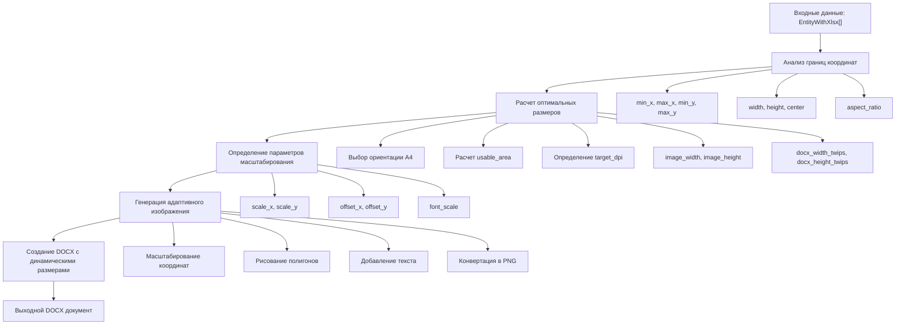

# Обзор проекта: Адаптивная система генерации изображений для DOCX

## Краткое описание

Проект направлен на создание адаптивной системы генерации изображений для DOCX документов, которая автоматически подстраивает размеры изображений и страниц под координаты фигур в каждом проекте, обеспечивая оптимальное размещение на листах формата A4.

## Цели проекта

### Основные цели
1. **Автоматическое определение границ** - Анализ координат фигур для расчета оптимальных размеров
2. **Адаптивное масштабирование A4** - Динамическое изменение размеров страниц и изображений
3. **4 изображения на этаж** - Генерация as1, as2, as3, as4 для каждого этажа
4. **Высокое качество** - Поддержание читаемости текста и четкости изображений
5. **Обратная совместимость** - Сохранение работы существующего кода
6. **Производительность** - Эффективная обработка больших объемов данных

### Технические требования
- Формат A4 (210×297 мм) в портретной или альбомной ориентации
- Автоматический выбор ориентации на основе соотношения сторон
- Адаптивные размеры шрифтов для читаемости
- Центрирование фигур в изображении
- Поддержка различных масштабов координат

## Структура документации

### 📋 Планирование и архитектура
- [`README.md`](../README.md) - Общий обзор и введение
- [`COMPLETE_PLAN.md`](../COMPLETE_PLAN.md) - Полный план реализации
- [`IMPLEMENTATION_PLAN.md`](../IMPLEMENTATION_PLAN.md) - Детальный план по этапам
- [`ARCHITECTURE.md`](../ARCHITECTURE.md) - Архитектура системы

### 🔧 Техническая документация
- [`TECHNICAL_DOCUMENTATION.md`](TECHNICAL_DOCUMENTATION.md) - Техническая архитектура и алгоритмы
- [`API_EXAMPLES.md`](API_EXAMPLES.md) - Примеры использования API
- [`INTEGRATION_FLOW.md`](../INTEGRATION_FLOW.md) - Процесс интеграции

### ⚡ Производительность и тестирование
- [`PERFORMANCE_OPTIMIZATION.md`](PERFORMANCE_OPTIMIZATION.md) - Оптимизация производительности
- [`TESTING_VALIDATION.md`](TESTING_VALIDATION.md) - Стратегия тестирования

## Ключевые компоненты системы

### 1. Анализатор границ (BoundsAnalyzer)
```rust
pub struct BoundsAnalyzer;

impl BoundsAnalyzer {
    pub fn analyze_entities(entities: &[EntityWithXlsx]) -> Result<CoordinateBounds, BoundsError>
    pub fn detect_outliers(bounds: &CoordinateBounds) -> Vec<OutlierInfo>
    pub fn calculate_complexity(entities: &[EntityWithXlsx]) -> ComplexityLevel
}
```

### 2. Калькулятор размеров (DimensionCalculator)
```rust
pub struct DimensionCalculator;

impl DimensionCalculator {
    pub fn calculate_optimal_dimensions(bounds: &CoordinateBounds, config: &A4Config) -> OptimalDimensions
    pub fn determine_orientation(bounds: &CoordinateBounds) -> PageOrientation
    pub fn calculate_target_dpi(complexity: ComplexityLevel) -> u32
}
```

### 3. Масштабировщик координат (CoordinateScaler)
```rust
pub struct CoordinateScaler;

impl CoordinateScaler {
    pub fn calculate_scaling_params(bounds: &CoordinateBounds, dimensions: &OptimalDimensions) -> ScalingParams
    pub fn scale_point(point: &Vertex, params: &ScalingParams) -> (f32, f32)
    pub fn adapt_font_size(base_size: f32, params: &ScalingParams) -> f32
}
```

### 4. Адаптивный рендерер (AdaptiveRenderer)
```rust
pub struct AdaptiveRenderer;

impl AdaptiveRenderer {
    pub fn render_image(entities: &[EntityWithXlsx], params: &RenderParams) -> Result<Vec<u8>, RenderError>
    pub fn draw_polygon(image: &mut ImageBuffer, vertices: &[Vertex], params: &ScalingParams)
    pub fn draw_text(image: &mut ImageBuffer, text: &str, position: (f32, f32), font_size: f32)
}
```

## Алгоритм работы



## Этапы реализации

### Этап 1: Подготовка инфраструктуры (3-4 дня)
- Создание модульной структуры
- Определение базовых типов данных
- Настройка конфигурации A4

### Этап 2: Анализ границ координат (2-3 дня)
- Реализация BoundsAnalyzer
- Обработка ошибок и граничных случаев
- Модульные тесты

### Этап 3: Расчет оптимальных размеров (2-3 дня)
- Реализация DimensionCalculator
- Алгоритмы выбора ориентации
- Расчет DPI и размеров

### Этап 4: Масштабирование координат (2 дня)
- Реализация CoordinateScaler
- Алгоритмы центрирования
- Адаптация размеров шрифтов

### Этап 5: Адаптивный рендеринг (3-4 дня)
- Модификация DrawItemZ
- Реализация draw_image_adaptive
- Интеграция всех компонентов

### Этап 6: Интеграция с DOCX (2-3 дня)
- Обновление docx_generator.rs
- Динамические размеры страниц
- Тестирование полного пайплайна

**Общее время: 2-3 недели**

## Конфигурация

### A4 параметры
```rust
pub struct A4Config {
    pub width_mm: f32,      // 210.0
    pub height_mm: f32,     // 297.0
    pub margin_mm: f32,     // 20.0
    pub min_dpi: u32,       // 150
    pub max_dpi: u32,       // 300
    pub default_dpi: u32,   // 200
}
```

### Настройки качества
```rust
pub enum QualityLevel {
    Draft,      // Быстро, низкое качество
    Standard,   // Баланс качества и скорости
    High,       // Высокое качество, медленнее
}
```

## Метрики производительности

### Целевые показатели
- **Анализ границ**: < 10ms для 1000 объектов
- **Расчет размеров**: < 5ms
- **Генерация изображения**: < 500ms для сложных сцен
- **Создание DOCX**: < 200ms на этаж
- **Память**: < 100MB для больших проектов

### Оптимизации
- Кэширование результатов анализа
- Параллельная обработка этажей
- Адаптивное качество изображений
- Ленивые вычисления

## Тестирование

### Типы тестов
1. **Модульные тесты** - Каждый компонент отдельно
2. **Интеграционные тесты** - Полный пайплайн
3. **Тесты производительности** - Бенчмарки
4. **Тесты качества** - Валидация изображений
5. **Регрессионные тесты** - Совместимость с legacy

### Автоматизация
- CI/CD пайплайн
- Автоматические бенчмарки
- Проверка качества изображений
- Мониторинг производительности

## Развертывание

### Стратегия миграции
1. **Legacy режим** - Существующий код без изменений
2. **A/B тестирование** - Параллельная работа систем
3. **Полный переход** - Использование только новой системы
4. **Удаление legacy** - Очистка старого кода

### Конфигурация переключения
```rust
#[derive(Debug, Clone)]
pub struct SystemConfig {
    pub use_adaptive_rendering: bool,
    pub fallback_to_legacy: bool,
    pub enable_performance_monitoring: bool,
    pub log_level: LogLevel,
}
```

## Заключение

Адаптивная система генерации изображений для DOCX представляет собой комплексное решение, которое:

✅ **Автоматически адаптируется** к любым координатам фигур  
✅ **Обеспечивает оптимальное размещение** на листах A4  
✅ **Поддерживает высокое качество** изображений и текста  
✅ **Сохраняет обратную совместимость** с существующим кодом  
✅ **Обеспечивает высокую производительность** для больших проектов  
✅ **Включает комплексное тестирование** и мониторинг  
✅ **Предоставляет гибкую конфигурацию** для различных сценариев  

Система готова к реализации и интеграции в существующий проект с минимальными рисками и максимальной эффективностью.

---

**Статус проекта**: Готов к реализации  
**Оценка времени**: 2-3 недели  
**Команда**: 1-2 разработчика  
**Риски**: Низкие (детальное планирование и тестирование)