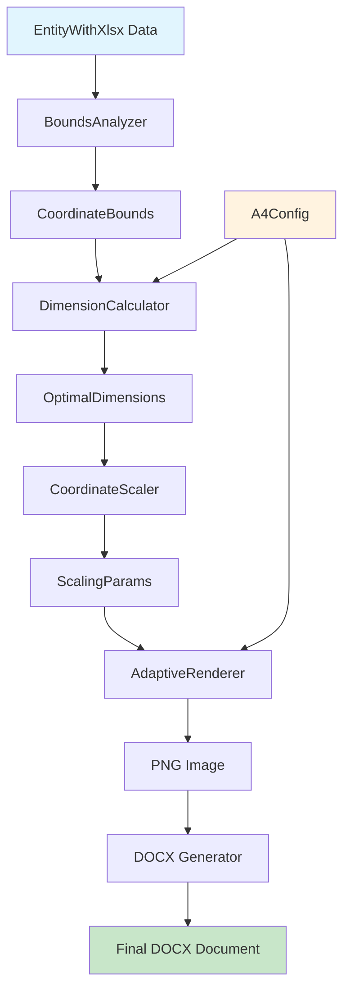
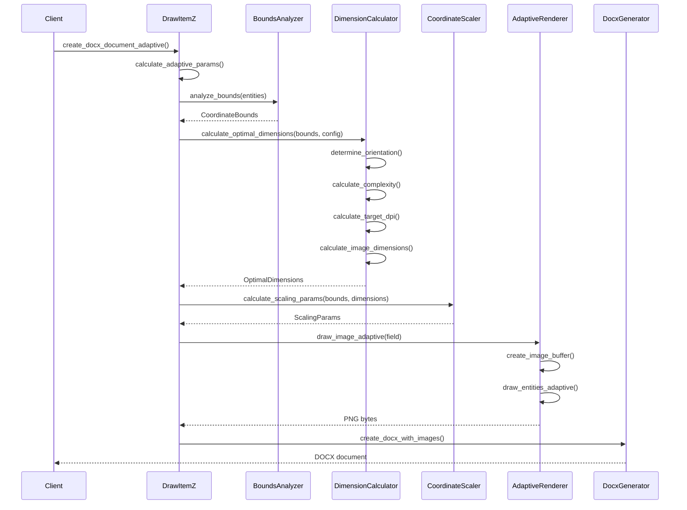
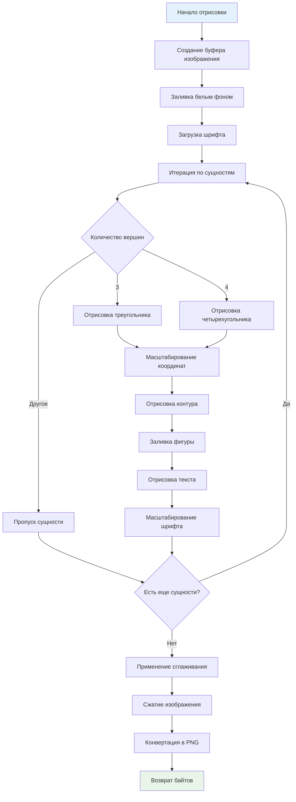
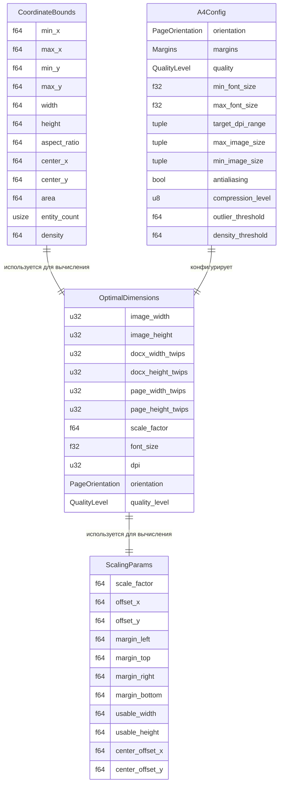
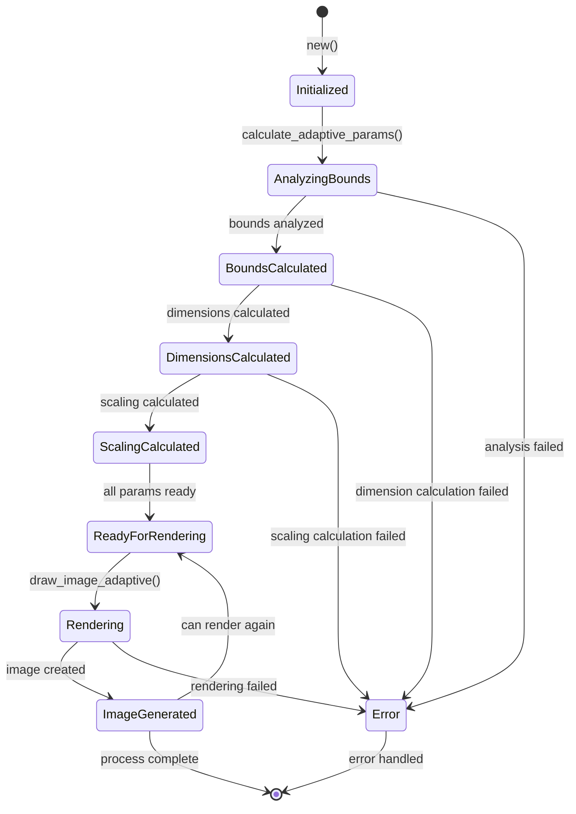
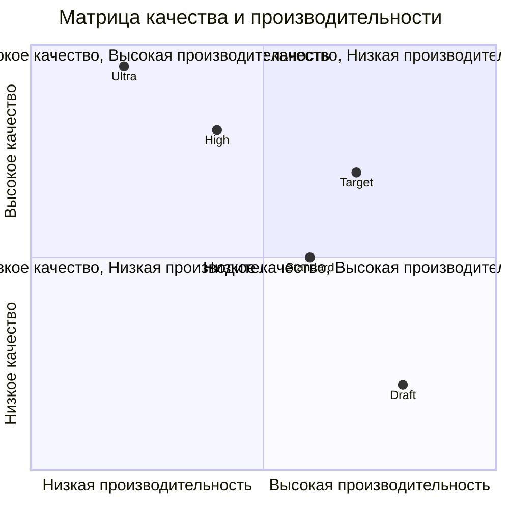
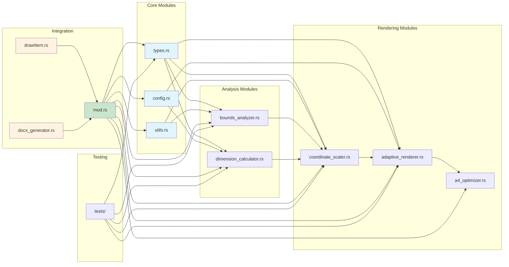
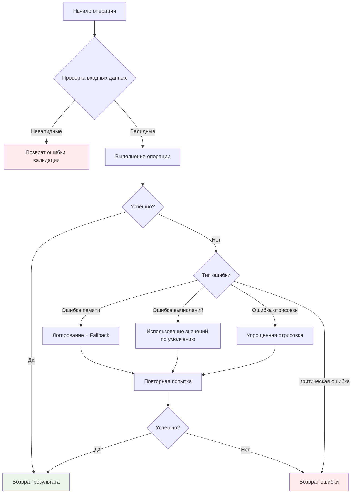
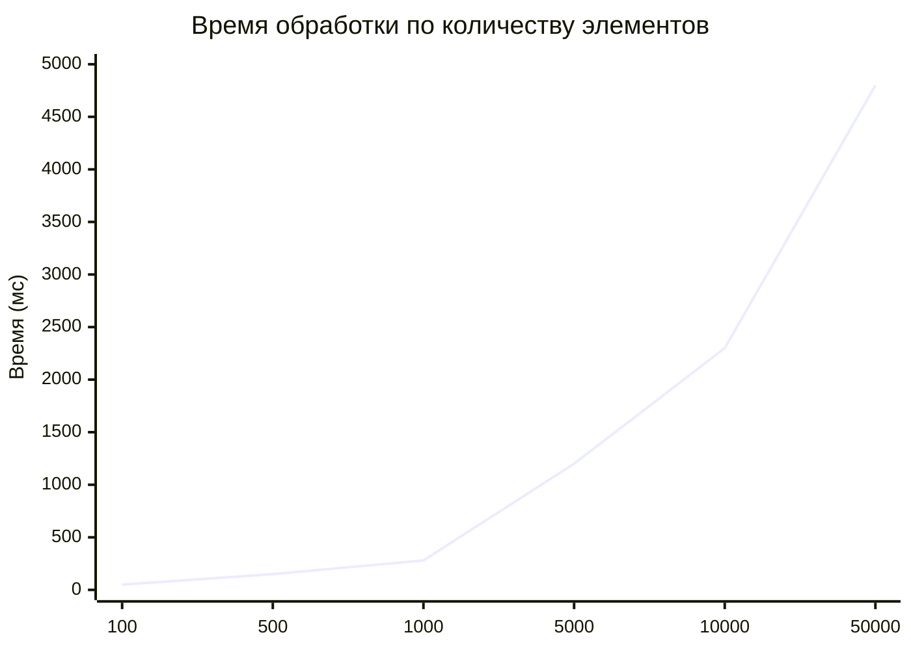

# Техническая документация системы адаптивной генерации изображений

## Обзор архитектуры

Система адаптивной генерации изображений представляет собой модульную архитектуру, состоящую из нескольких взаимосвязанных компонентов, каждый из которых отвечает за определенный аспект обработки данных и генерации изображений.



## Диаграмма компонентов

```mermaid
classDiagram
    class BoundsAnalyzer {
        +analyze_bounds(entities: &[EntityWithXlsx]) CoordinateBounds
        +detect_outliers(entities: &[EntityWithXlsx], threshold: f64) Vec~usize~
        +filter_outliers(entities: &[EntityWithXlsx], outliers: &[usize]) Vec~EntityWithXlsx~
        +calculate_statistics(entities: &[EntityWithXlsx]) CoordinateStatistics
    }
    
    class DimensionCalculator {
        +calculate_optimal_dimensions(bounds: &CoordinateBounds, config: &A4Config) OptimalDimensions
        -determine_orientation(aspect_ratio: f64, config: PageOrientation) PageOrientation
        -calculate_complexity(bounds: &CoordinateBounds) f64
        -calculate_target_dpi(complexity: f64, quality: QualityLevel, range: &(u32, u32)) u32
        -calculate_image_dimensions(width: f64, height: f64, dpi: u32, max: &(u32, u32), min: &(u32, u32)) (u32, u32)
    }
    
    class CoordinateScaler {
        +calculate_scaling_params(bounds: &CoordinateBounds, dimensions: &OptimalDimensions) ScalingParams
        +scale_point(vertex: &Vertex, params: &ScalingParams) (f32, f32)
        +scale_font_size(base_size: f32, params: &ScalingParams) f32
        +is_point_in_bounds(x: f32, y: f32, width: u32, height: u32) bool
    }
    
    class AdaptiveRenderer {
        +draw_image_adaptive(field: &str) Vec~u8~
        +calculate_adaptive_params() Result~(), String~
        -draw_entities_adaptive(img: &mut ImageBuffer, field: &str, scaling: &ScalingParams, dimensions: &OptimalDimensions) Result~(), String~
        -draw_triangle_adaptive(img: &mut ImageBuffer, entity: &EntityWithXlsx, scaling: &ScalingParams, font: &Font, font_size: f32) Result~(), String~
        -draw_quadrilateral_adaptive(img: &mut ImageBuffer, entity: &EntityWithXlsx, scaling: &ScalingParams, font: &Font, font_size: f32) Result~(), String~
    }
    
    class A4Config {
        +orientation: PageOrientation
        +margins: Margins
        +quality: QualityLevel
        +min_font_size: f32
        +max_font_size: f32
        +target_dpi_range: (u32, u32)
        +max_image_size: (u32, u32)
        +min_image_size: (u32, u32)
        +antialiasing: bool
        +compression_level: u8
        +outlier_threshold: f64
        +density_threshold: f64
    }
    
    BoundsAnalyzer --> CoordinateBounds
    DimensionCalculator --> OptimalDimensions
    CoordinateScaler --> ScalingParams
    AdaptiveRenderer --> "PNG Image"
    A4Config --> DimensionCalculator
    A4Config --> AdaptiveRenderer
```

## Поток данных



## Алгоритм анализа границ

```mermaid
flowchart TD
    A[Входные данные: EntityWithXlsx[]] --> B{Данные пустые?}
    B -->|Да| C[Возврат ошибки]
    B -->|Нет| D[Инициализация границ]
    D --> E[Итерация по сущностям]
    E --> F[Итерация по вершинам]
    F --> G[Обновление min/max координат]
    G --> H{Есть еще вершины?}
    H -->|Да| F
    H -->|Нет| I{Есть еще сущности?}
    I -->|Да| E
    I -->|Нет| J[Вычисление производных значений]
    J --> K[width = max_x - min_x]
    K --> L[height = max_y - min_y]
    L --> M[aspect_ratio = width / height]
    M --> N[center_x = (min_x + max_x) / 2]
    N --> O[center_y = (min_y + max_y) / 2]
    O --> P[area = width * height]
    P --> Q[density = vertices_count / area]
    Q --> R[Возврат CoordinateBounds]
    
    style A fill:#e3f2fd
    style R fill:#e8f5e8
    style C fill:#ffebee
```

## Алгоритм вычисления оптимальных размеров

```mermaid
flowchart TD
    A[Входные данные: CoordinateBounds + A4Config] --> B[Определение ориентации страницы]
    B --> C{Ориентация = Auto?}
    C -->|Да| D{aspect_ratio > 1.4?}
    D -->|Да| E[Landscape]
    D -->|Нет| F[Portrait]
    C -->|Нет| G[Использовать заданную]
    E --> H[Получение размеров A4]
    F --> H
    G --> H
    
    H --> I[Применение отступов]
    I --> J[Вычисление сложности]
    J --> K[area_factor = area / 1000000]
    K --> L[density_factor = density * 1000]
    L --> M[entity_factor = entity_count / 1000]
    M --> N[complexity = (area + density + entity) / 3]
    
    N --> O[Вычисление целевого DPI]
    O --> P{Уровень качества}
    P -->|Draft| Q[base_dpi = 150]
    P -->|Standard| R[base_dpi = 300]
    P -->|High| S[base_dpi = 600]
    P -->|Ultra| T[base_dpi = 1200]
    
    Q --> U[Корректировка по сложности]
    R --> U
    S --> U
    T --> U
    
    U --> V[adjusted_dpi = base_dpi * (1 + (complexity - 5) * 0.1)]
    V --> W[Ограничение в заданном диапазоне]
    W --> X[Вычисление размеров изображения]
    X --> Y[Вычисление масштабного коэффициента]
    Y --> Z[Вычисление размера шрифта]
    Z --> AA[Возврат OptimalDimensions]
    
    style A fill:#e3f2fd
    style AA fill:#e8f5e8
```

## Алгоритм масштабирования координат

```mermaid
flowchart TD
    A[Входные данные: CoordinateBounds + OptimalDimensions] --> B[Определение отступов]
    B --> C[margin_left = 50px]
    C --> D[margin_top = 50px]
    D --> E[margin_right = 50px]
    E --> F[margin_bottom = 50px]
    
    F --> G[Вычисление рабочей области]
    G --> H[usable_width = image_width - margin_left - margin_right]
    H --> I[usable_height = image_height - margin_top - margin_bottom]
    
    I --> J[Вычисление масштабных коэффициентов]
    J --> K[scale_x = usable_width / bounds.width]
    K --> L[scale_y = usable_height / bounds.height]
    L --> M[scale_factor = min(scale_x, scale_y)]
    
    M --> N[Вычисление размеров после масштабирования]
    N --> O[scaled_width = bounds.width * scale_factor]
    O --> P[scaled_height = bounds.height * scale_factor]
    
    P --> Q[Вычисление смещений для центрирования]
    Q --> R[center_offset_x = (usable_width - scaled_width) / 2]
    R --> S[center_offset_y = (usable_height - scaled_height) / 2]
    
    S --> T[Вычисление финальных смещений]
    T --> U[offset_x = margin_left + center_offset_x - bounds.min_x * scale_factor]
    U --> V[offset_y = margin_top + center_offset_y - bounds.min_y * scale_factor]
    
    V --> W[Возврат ScalingParams]
    
    style A fill:#e3f2fd
    style W fill:#e8f5e8
```

## Процесс адаптивной отрисовки



## Структура данных



## Диаграмма состояний DrawItemZ



## Матрица качества и производительности



## Временная диаграмма обработки

```mermaid
gantt
    title Временная диаграмма обработки запроса
    dateFormat X
    axisFormat %s
    
    section Анализ данных
    Анализ границ           :a1, 0, 100
    Обнаружение выбросов    :a2, after a1, 50
    
    section Вычисления
    Расчет размеров         :b1, after a2, 150
    Расчет масштабирования  :b2, after b1, 100
    
    section Отрисовка
    Создание буфера         :c1, after b2, 50
    Отрисовка фигур         :c2, after c1, 300
    Отрисовка текста        :c3, after c2, 200
    
    section Финализация
    Сжатие изображения      :d1, after c3, 100
    Создание DOCX           :d2, after d1, 150
```



## Архитектура модулей



## Обработка ошибок



## Метрики производительности



## Заключение

Данная техническая документация предоставляет полное представление об архитектуре, алгоритмах и процессах системы адаптивной генерации изображений. Диаграммы Mermaid визуализируют ключевые аспекты системы и помогают понять взаимосвязи между компонентами.

Система спроектирована с учетом принципов модульности, расширяемости и производительности, что обеспечивает возможность дальнейшего развития и оптимизации.