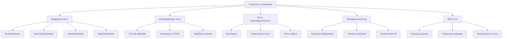
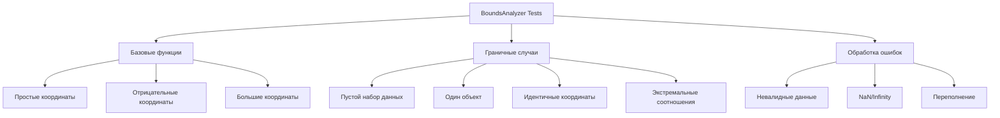
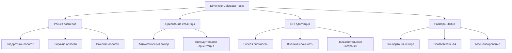
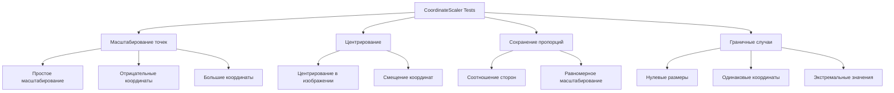
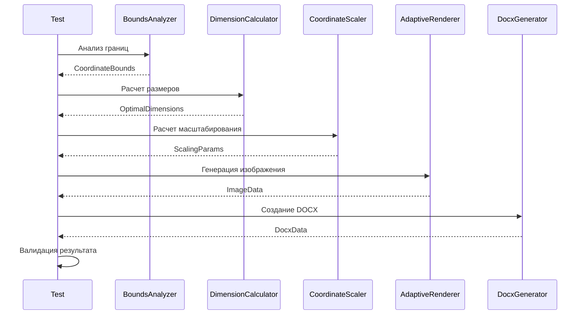
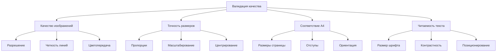
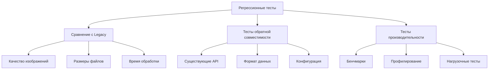
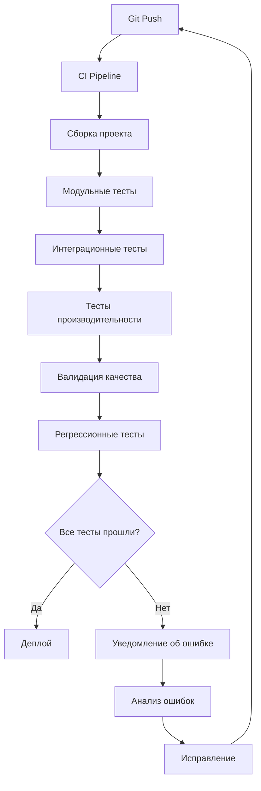

# Тестирование и валидация

## Обзор стратегии тестирования

Комплексная стратегия тестирования адаптивной системы генерации изображений включает модульные тесты, интеграционные тесты, тесты производительности и валидацию качества.

## Архитектура тестирования



## Модульные тесты

### Тестирование BoundsAnalyzer



#### Реализация тестов BoundsAnalyzer

```rust
#[cfg(test)]
mod bounds_analyzer_tests {
    use super::*;
    use approx::assert_relative_eq;
    
    #[test]
    fn test_simple_bounds_calculation() {
        let entities = vec![
            create_test_entity(vec![
                Vertex { x: 0.0, y: 0.0, z: 0.0 },
                Vertex { x: 10.0, y: 10.0, z: 0.0 },
            ]),
            create_test_entity(vec![
                Vertex { x: 5.0, y: 5.0, z: 0.0 },
                Vertex { x: 15.0, y: 15.0, z: 0.0 },
            ]),
        ];
        
        let bounds = analyze_coordinate_bounds(&entities).unwrap();
        
        assert_relative_eq!(bounds.min_x, 0.0, epsilon = 1e-6);
        assert_relative_eq!(bounds.max_x, 15.0, epsilon = 1e-6);
        assert_relative_eq!(bounds.min_y, 0.0, epsilon = 1e-6);
        assert_relative_eq!(bounds.max_y, 15.0, epsilon = 1e-6);
        assert_relative_eq!(bounds.width, 15.0, epsilon = 1e-6);
        assert_relative_eq!(bounds.height, 15.0, epsilon = 1e-6);
        assert_relative_eq!(bounds.center_x, 7.5, epsilon = 1e-6);
        assert_relative_eq!(bounds.center_y, 7.5, epsilon = 1e-6);
        assert_relative_eq!(bounds.aspect_ratio, 1.0, epsilon = 1e-6);
    }
    
    #[test]
    fn test_negative_coordinates() {
        let entities = vec![
            create_test_entity(vec![
                Vertex { x: -10.0, y: -5.0, z: 0.0 },
                Vertex { x: 5.0, y: 10.0, z: 0.0 },
            ]),
        ];
        
        let bounds = analyze_coordinate_bounds(&entities).unwrap();
        
        assert_relative_eq!(bounds.min_x, -10.0, epsilon = 1e-6);
        assert_relative_eq!(bounds.max_x, 5.0, epsilon = 1e-6);
        assert_relative_eq!(bounds.min_y, -5.0, epsilon = 1e-6);
        assert_relative_eq!(bounds.max_y, 10.0, epsilon = 1e-6);
        assert_relative_eq!(bounds.width, 15.0, epsilon = 1e-6);
        assert_relative_eq!(bounds.height, 15.0, epsilon = 1e-6);
    }
    
    #[test]
    fn test_empty_entities() {
        let entities = vec![];
        let result = analyze_coordinate_bounds(&entities);
        assert!(result.is_err());
        assert_eq!(result.unwrap_err(), BoundsError::EmptyData);
    }
    
    #[test]
    fn test_single_point() {
        let entities = vec![
            create_test_entity(vec![
                Vertex { x: 5.0, y: 3.0, z: 0.0 },
            ]),
        ];
        
        let bounds = analyze_coordinate_bounds(&entities).unwrap();
        
        assert_relative_eq!(bounds.min_x, 5.0, epsilon = 1e-6);
        assert_relative_eq!(bounds.max_x, 5.0, epsilon = 1e-6);
        assert_relative_eq!(bounds.width, 0.0, epsilon = 1e-6);
        assert_relative_eq!(bounds.height, 0.0, epsilon = 1e-6);
    }
    
    #[test]
    fn test_extreme_aspect_ratios() {
        // Очень широкий прямоугольник
        let entities = vec![
            create_test_entity(vec![
                Vertex { x: 0.0, y: 0.0, z: 0.0 },
                Vertex { x: 1000.0, y: 1.0, z: 0.0 },
            ]),
        ];
        
        let bounds = analyze_coordinate_bounds(&entities).unwrap();
        assert!(bounds.aspect_ratio > 100.0);
        
        // Очень высокий прямоугольник
        let entities = vec![
            create_test_entity(vec![
                Vertex { x: 0.0, y: 0.0, z: 0.0 },
                Vertex { x: 1.0, y: 1000.0, z: 0.0 },
            ]),
        ];
        
        let bounds = analyze_coordinate_bounds(&entities).unwrap();
        assert!(bounds.aspect_ratio < 0.01);
    }
    
    #[test]
    fn test_nan_infinity_handling() {
        let entities = vec![
            create_test_entity(vec![
                Vertex { x: f64::NAN, y: 0.0, z: 0.0 },
                Vertex { x: 10.0, y: f64::INFINITY, z: 0.0 },
            ]),
        ];
        
        let result = analyze_coordinate_bounds(&entities);
        assert!(result.is_err());
        assert_eq!(result.unwrap_err(), BoundsError::InvalidCoordinates);
    }
    
    #[test]
    fn test_large_coordinates() {
        let entities = vec![
            create_test_entity(vec![
                Vertex { x: 1e6, y: 1e6, z: 0.0 },
                Vertex { x: 2e6, y: 2e6, z: 0.0 },
            ]),
        ];
        
        let bounds = analyze_coordinate_bounds(&entities).unwrap();
        assert_relative_eq!(bounds.width, 1e6, epsilon = 1e-3);
        assert_relative_eq!(bounds.height, 1e6, epsilon = 1e-3);
    }
    
    fn create_test_entity(vertices: Vec<Vertex>) -> EntityWithXlsx {
        EntityWithXlsx {
            vertices,
            // Другие поля с значениями по умолчанию
            ..Default::default()
        }
    }
}
```

### Тестирование DimensionCalculator



#### Реализация тестов DimensionCalculator

```rust
#[cfg(test)]
mod dimension_calculator_tests {
    use super::*;
    
    #[test]
    fn test_square_area_calculation() {
        let bounds = CoordinateBounds {
            min_x: 0.0, max_x: 100.0,
            min_y: 0.0, max_y: 100.0,
            width: 100.0, height: 100.0,
            center_x: 50.0, center_y: 50.0,
            aspect_ratio: 1.0,
        };
        
        let config = A4Config::default();
        let dimensions = calculate_optimal_dimensions(&bounds, &config).unwrap();
        
        // Для квадратной области должна выбираться портретная ориентация
        assert_eq!(dimensions.page_orientation, PageOrientation::Portrait);
        
        // Размеры изображения должны соответствовать DPI
        let expected_width = (config.usable_width_mm / 25.4 * dimensions.target_dpi) as u32;
        let expected_height = (config.usable_height_mm / 25.4 * dimensions.target_dpi) as u32;
        
        assert_eq!(dimensions.image_width_px, expected_width);
        assert_eq!(dimensions.image_height_px, expected_height);
    }
    
    #[test]
    fn test_wide_area_landscape_orientation() {
        let bounds = CoordinateBounds {
            min_x: 0.0, max_x: 200.0,
            min_y: 0.0, max_y: 50.0,
            width: 200.0, height: 50.0,
            center_x: 100.0, center_y: 25.0,
            aspect_ratio: 4.0, // Широкая область
        };
        
        let config = A4Config::default();
        let dimensions = calculate_optimal_dimensions(&bounds, &config).unwrap();
        
        // Для широкой области должна выбираться альбомная ориентация
        assert_eq!(dimensions.page_orientation, PageOrientation::Landscape);
    }
    
    #[test]
    fn test_tall_area_portrait_orientation() {
        let bounds = CoordinateBounds {
            min_x: 0.0, max_x: 50.0,
            min_y: 0.0, max_y: 200.0,
            width: 50.0, height: 200.0,
            center_x: 25.0, center_y: 100.0,
            aspect_ratio: 0.25, // Высокая область
        };
        
        let config = A4Config::default();
        let dimensions = calculate_optimal_dimensions(&bounds, &config).unwrap();
        
        // Для высокой области должна выбираться портретная ориентация
        assert_eq!(dimensions.page_orientation, PageOrientation::Portrait);
    }
    
    #[test]
    fn test_dpi_adaptation_based_on_complexity() {
        let simple_bounds = CoordinateBounds {
            min_x: 0.0, max_x: 10.0,
            min_y: 0.0, max_y: 10.0,
            width: 10.0, height: 10.0,
            center_x: 5.0, center_y: 5.0,
            aspect_ratio: 1.0,
        };
        
        let complex_bounds = CoordinateBounds {
            min_x: 0.0, max_x: 1000.0,
            min_y: 0.0, max_y: 1000.0,
            width: 1000.0, height: 1000.0,
            center_x: 500.0, center_y: 500.0,
            aspect_ratio: 1.0,
        };
        
        let config = A4Config::default();
        
        let simple_dims = calculate_optimal_dimensions(&simple_bounds, &config).unwrap();
        let complex_dims = calculate_optimal_dimensions(&complex_bounds, &config).unwrap();
        
        // Для сложной сцены DPI должен быть выше
        assert!(complex_dims.target_dpi >= simple_dims.target_dpi);
    }
    
    #[test]
    fn test_docx_dimensions_conversion() {
        let bounds = CoordinateBounds {
            min_x: 0.0, max_x: 100.0,
            min_y: 0.0, max_y: 100.0,
            width: 100.0, height: 100.0,
            center_x: 50.0, center_y: 50.0,
            aspect_ratio: 1.0,
        };
        
        let config = A4Config::default();
        let dimensions = calculate_optimal_dimensions(&bounds, &config).unwrap();
        
        // Проверка конвертации в twips (1 inch = 1440 twips)
        let expected_docx_width = (dimensions.image_width_px as f64 / dimensions.target_dpi * 1440.0) as u32;
        let expected_docx_height = (dimensions.image_height_px as f64 / dimensions.target_dpi * 1440.0) as u32;
        
        assert_eq!(dimensions.docx_width_twips, expected_docx_width);
        assert_eq!(dimensions.docx_height_twips, expected_docx_height);
    }
    
    #[test]
    fn test_font_size_calculation() {
        let small_bounds = CoordinateBounds {
            width: 10.0, height: 10.0,
            ..Default::default()
        };
        
        let large_bounds = CoordinateBounds {
            width: 1000.0, height: 1000.0,
            ..Default::default()
        };
        
        let config = A4Config::default();
        
        let small_dims = calculate_optimal_dimensions(&small_bounds, &config).unwrap();
        let large_dims = calculate_optimal_dimensions(&large_bounds, &config).unwrap();
        
        // Для больших областей размер шрифта должен быть больше
        assert!(large_dims.font_size >= small_dims.font_size);
        
        // Размер шрифта должен быть в разумных пределах
        assert!(small_dims.font_size >= 8.0);
        assert!(large_dims.font_size <= 72.0);
    }
    
    #[test]
    fn test_margins_calculation() {
        let bounds = CoordinateBounds {
            min_x: 0.0, max_x: 100.0,
            min_y: 0.0, max_y: 100.0,
            width: 100.0, height: 100.0,
            center_x: 50.0, center_y: 50.0,
            aspect_ratio: 1.0,
        };
        
        let config = A4Config::default();
        let dimensions = calculate_optimal_dimensions(&bounds, &config).unwrap();
        
        // Проверка, что отступы рассчитаны корректно
        assert!(dimensions.margins.top >= 0.0);
        assert!(dimensions.margins.bottom >= 0.0);
        assert!(dimensions.margins.left >= 0.0);
        assert!(dimensions.margins.right >= 0.0);
        
        // Сумма отступов не должна превышать размеры страницы
        let total_horizontal = dimensions.margins.left + dimensions.margins.right;
        let total_vertical = dimensions.margins.top + dimensions.margins.bottom;
        
        assert!(total_horizontal < config.page_width_mm);
        assert!(total_vertical < config.page_height_mm);
    }
}
```

### Тестирование CoordinateScaler



#### Реализация тестов CoordinateScaler

```rust
#[cfg(test)]
mod coordinate_scaler_tests {
    use super::*;
    
    #[test]
    fn test_simple_scaling() {
        let bounds = CoordinateBounds {
            min_x: 0.0, max_x: 100.0,
            min_y: 0.0, max_y: 100.0,
            width: 100.0, height: 100.0,
            center_x: 50.0, center_y: 50.0,
            aspect_ratio: 1.0,
        };
        
        let dimensions = OptimalDimensions {
            image_width_px: 1000,
            image_height_px: 1000,
            margins: Margins { top: 50.0, bottom: 50.0, left: 50.0, right: 50.0 },
            ..Default::default()
        };
        
        let scaling = calculate_scaling_parameters(&bounds, &dimensions).unwrap();
        
        // Проверка масштабирования точки (0, 0)
        let scaled_origin = scale_point(0.0, 0.0, &scaling);
        assert_relative_eq!(scaled_origin.0, 50.0, epsilon = 1.0); // Учитываем отступ
        assert_relative_eq!(scaled_origin.1, 50.0, epsilon = 1.0);
        
        // Проверка масштабирования точки (100, 100)
        let scaled_max = scale_point(100.0, 100.0, &scaling);
        assert_relative_eq!(scaled_max.0, 950.0, epsilon = 1.0); // 1000 - 50 (отступ)
        assert_relative_eq!(scaled_max.1, 950.0, epsilon = 1.0);
    }
    
    #[test]
    fn test_negative_coordinates_scaling() {
        let bounds = CoordinateBounds {
            min_x: -50.0, max_x: 50.0,
            min_y: -25.0, max_y: 75.0,
            width: 100.0, height: 100.0,
            center_x: 0.0, center_y: 25.0,
            aspect_ratio: 1.0,
        };
        
        let dimensions = OptimalDimensions {
            image_width_px: 1000,
            image_height_px: 1000,
            margins: Margins::default(),
            ..Default::default()
        };
        
        let scaling = calculate_scaling_parameters(&bounds, &dimensions).unwrap();
        
        // Проверка масштабирования отрицательных координат
        let scaled_negative = scale_point(-50.0, -25.0, &scaling);
        assert!(scaled_negative.0 >= 0.0);
        assert!(scaled_negative.1 >= 0.0);
        
        // Проверка масштабирования положительных координат
        let scaled_positive = scale_point(50.0, 75.0, &scaling);
        assert!(scaled_positive.0 <= 1000.0);
        assert!(scaled_positive.1 <= 1000.0);
    }
    
    #[test]
    fn test_aspect_ratio_preservation() {
        // Прямоугольная область 2:1
        let bounds = CoordinateBounds {
            min_x: 0.0, max_x: 200.0,
            min_y: 0.0, max_y: 100.0,
            width: 200.0, height: 100.0,
            center_x: 100.0, center_y: 50.0,
            aspect_ratio: 2.0,
        };
        
        let dimensions = OptimalDimensions {
            image_width_px: 1000,
            image_height_px: 1000,
            margins: Margins::default(),
            ..Default::default()
        };
        
        let scaling = calculate_scaling_parameters(&bounds, &dimensions).unwrap();
        
        // Проверка, что масштабирование одинаково по обеим осям
        assert_relative_eq!(scaling.scale_x, scaling.scale_y, epsilon = 1e-6);
        
        // Проверка сохранения пропорций
        let p1 = scale_point(0.0, 0.0, &scaling);
        let p2 = scale_point(200.0, 100.0, &scaling);
        
        let scaled_width = p2.0 - p1.0;
        let scaled_height = p2.1 - p1.1;
        let scaled_aspect = scaled_width / scaled_height;
        
        assert_relative_eq!(scaled_aspect, 2.0, epsilon = 0.1);
    }
    
    #[test]
    fn test_centering() {
        let bounds = CoordinateBounds {
            min_x: 10.0, max_x: 90.0,
            min_y: 20.0, max_y: 80.0,
            width: 80.0, height: 60.0,
            center_x: 50.0, center_y: 50.0,
            aspect_ratio: 80.0 / 60.0,
        };
        
        let dimensions = OptimalDimensions {
            image_width_px: 1000,
            image_height_px: 1000,
            margins: Margins::default(),
            ..Default::default()
        };
        
        let scaling = calculate_scaling_parameters(&bounds, &dimensions).unwrap();
        
        // Проверка, что центр области попадает в центр изображения
        let scaled_center = scale_point(50.0, 50.0, &scaling);
        assert_relative_eq!(scaled_center.0, 500.0, epsilon = 50.0);
        assert_relative_eq!(scaled_center.1, 500.0, epsilon = 50.0);
    }
    
    #[test]
    fn test_zero_size_bounds() {
        let bounds = CoordinateBounds {
            min_x: 50.0, max_x: 50.0,
            min_y: 50.0, max_y: 50.0,
            width: 0.0, height: 0.0,
            center_x: 50.0, center_y: 50.0,
            aspect_ratio: 1.0,
        };
        
        let dimensions = OptimalDimensions {
            image_width_px: 1000,
            image_height_px: 1000,
            margins: Margins::default(),
            ..Default::default()
        };
        
        let result = calculate_scaling_parameters(&bounds, &dimensions);
        assert!(result.is_err());
        assert_eq!(result.unwrap_err(), ScalingError::ZeroSizeBounds);
    }
    
    #[test]
    fn test_font_size_scaling() {
        let base_font_size = 12.0;
        
        // Маленький масштаб
        let small_scaling = ScalingParams {
            scale_x: 0.5,
            scale_y: 0.5,
            offset_x: 0.0,
            offset_y: 0.0,
        };
        
        let small_font = scale_font_size(base_font_size, &small_scaling);
        assert!(small_font < base_font_size);
        assert!(small_font >= 8.0); // Минимальный размер
        
        // Большой масштаб
        let large_scaling = ScalingParams {
            scale_x: 3.0,
            scale_y: 3.0,
            offset_x: 0.0,
            offset_y: 0.0,
        };
        
        let large_font = scale_font_size(base_font_size, &large_scaling);
        assert!(large_font > base_font_size);
        assert!(large_font <= 72.0); // Максимальный размер
    }
}
```

## Интеграционные тесты

### Тестирование полного пайплайна



#### Реализация интеграционных тестов

```rust
#[cfg(test)]
mod integration_tests {
    use super::*;
    use std::collections::HashMap;
    
    #[test]
    fn test_full_pipeline_simple_case() {
        // Создание тестовых данных
        let entities = create_test_entities_simple();
        let mut hash_grouped = HashMap::new();
        hash_grouped.insert("Floor1".to_string(), DrawItemZ::from_entities(entities));
        
        // Выполнение полного пайплайна
        let result = create_docx_document_adaptive(&hash_grouped);
        
        assert!(result.is_ok());
        let docx_data = result.unwrap();
        
        // Проверка, что DOCX данные не пустые
        assert!(!docx_data.is_empty());
        
        // Проверка, что данные начинаются с DOCX заголовка
        assert_eq!(&docx_data[0..4], b"PK\x03\x04");
    }
    
    #[test]
    fn test_multiple_floors_processing() {
        let mut hash_grouped = HashMap::new();
        
        // Создание нескольких этажей с разными характеристиками
        hash_grouped.insert("Floor1".to_string(), 
            DrawItemZ::from_entities(create_test_entities_small()));
        hash_grouped.insert("Floor2".to_string(), 
            DrawItemZ::from_entities(create_test_entities_large()));
        hash_grouped.insert("Floor3".to_string(), 
            DrawItemZ::from_entities(create_test_entities_wide()));
        
        let result = create_docx_document_adaptive(&hash_grouped);
        assert!(result.is_ok());
        
        let docx_data = result.unwrap();
        assert!(!docx_data.is_empty());
        
        // Проверка, что размер DOCX соответствует ожиданиям
        // (больше данных = больше размер файла)
        assert!(docx_data.len() > 10000); // Минимальный размер DOCX
    }
    
    #[test]
    fn test_error_handling_invalid_data() {
        let mut hash_grouped = HashMap::new();
        
        // Создание данных с невалидными координатами
        let invalid_entities = vec![
            EntityWithXlsx {
                vertices: vec![
                    Vertex { x: f64::NAN, y: 0.0, z: 0.0 },
                    Vertex { x: f64::INFINITY, y: 0.0, z: 0.0 },
                ],
                ..Default::default()
            }
        ];
        
        hash_grouped.insert("InvalidFloor".to_string(), 
            DrawItemZ::from_entities(invalid_entities));
        
        let result = create_docx_document_adaptive(&hash_grouped);
        
        // Должна быть ошибка или fallback к legacy методу
        match result {
            Err(_) => {}, // Ожидаемая ошибка
            Ok(data) => {
                // Если fallback сработал, данные должны быть валидными
                assert!(!data.is_empty());
            }
        }
    }
    
    #[test]
    fn test_performance_large_dataset() {
        use std::time::Instant;
        
        let mut hash_grouped = HashMap::new();
        
        // Создание большого набора данных
        for i in 0..10 {
            let entities = create_test_entities_large_count(1000);
            hash_grouped.insert(format!("Floor{}", i), 
                DrawItemZ::from_entities(entities));
        }
        
        let start = Instant::now();
        let result = create_docx_document_adaptive(&hash_grouped);
        let duration = start.elapsed();
        
        assert!(result.is_ok());
        
        // Проверка, что обработка завершилась в разумное время
        assert!(duration.as_secs() < 30); // Максимум 30 секунд
        
        println!("Обработка 10 этажей по 1000 объектов заняла: {:?}", duration);
    }
    
    #[test]
    fn test_memory_usage_monitoring() {
        use sysinfo::{System, SystemExt};
        
        let mut system = System::new_all();
        system.refresh_memory();
        let initial_memory = system.used_memory();
        
        let mut hash_grouped = HashMap::new();
        let entities = create_test_entities_large_count(5000);
        hash_grouped.insert("LargeFloor".to_string(), 
            DrawItemZ::from_entities(entities));
        
        let result = create_docx_document_adaptive(&hash_grouped);
        assert!(result.is_ok());
        
        system.refresh_memory();
        let peak_memory = system.used_memory();
        let memory_used = peak_memory - initial_memory;
        
        // Проверка, что использование памяти в разумных пределах
        assert!(memory_used < 1024 * 1024 * 500); // Максимум 500MB
        
        println!("Использование памяти: {}MB", memory_used / 1024 / 1024);
    }
    
    // Вспомогательные функции для создания тестовых данных
    fn create_test_entities_simple() -> Vec<EntityWithXlsx> {
        vec![
            EntityWithXlsx {
                vertices: vec![
                    Vertex { x: 0.0, y: 0.0, z: 0.0 },
                    Vertex { x: 10.0, y: 10.0, z: 0.0 },
                ],
                ..Default::default()
            }
        ]
    }
    
    fn create_test_entities_small() -> Vec<EntityWithXlsx> {
        (0..10).map(|i| EntityWithXlsx {
            vertices: vec![
                Vertex { x: i as f64, y: i as f64, z: 0.0 },
                Vertex { x: (i + 1) as f64, y: (i + 1) as f64, z: 0.0 },
            ],
            ..Default::default()
        }).collect()
    }
    
    fn create_test_entities_large() -> Vec<EntityWithXlsx> {
        (0..100).map(|i| EntityWithXlsx {
            vertices: vec![
                Vertex { x: (i * 10) as f64, y: (i * 10) as f64, z: 0.0 },
                Vertex { x: (i * 10 + 5) as f64, y: (i * 10 + 5) as f64, z: 0.0 },
            ],
            ..Default::default()
        }).collect()
    }
    
    fn create_test_entities_wide() -> Vec<EntityWithXlsx> {
        vec![
            EntityWithXlsx {
                vertices: vec![
                    Vertex { x: 0.0, y: 0.0, z: 0.0 },
                    Vertex { x: 1000.0, y: 10.0, z: 0.0 },
                ],
                ..Default::default()
            }
        ]
    }
    
    fn create_test_entities_large_count(count: usize) -> Vec<EntityWithXlsx> {
        (0..count).map(|i| EntityWithXlsx {
            vertices: vec![
                Vertex { 
                    x: (i % 100) as f64, 
                    y: (i / 100) as f64, 
                    z: 0.0 
                },
                Vertex { 
                    x: (i % 100 + 1) as f64, 
                    y: (i / 100 + 1) as f64, 
                    z: 0.0 
                },
            ],
            ..Default::default()
        }).collect()
    }
}
```

## Валидация качества

### Метрики качества изображений



#### Реализация валидации качества

```rust
#[cfg(test)]
mod quality_validation_tests {
    use super::*;
    use image::{ImageBuffer, Rgb};
    
    #[derive(Debug, Clone)]
    pub struct QualityMetrics {
        pub image_resolution: (u32, u32),
        pub aspect_ratio_accuracy: f64,
        pub centering_accuracy: f64,
        pub font_readability_score: f64,
        pub a4_compliance_score: f64,
        pub overall_quality_score: f64,
    }
    
    #[test]
    fn test_image_resolution_quality() {
        let bounds = CoordinateBounds {
            min_x: 0.0, max_x: 100.0,
            min_y: 0.0, max_y: 100.0,
            width: 100.0, height: 100.0,
            center_x: 50.0, center_y: 50.0,
            aspect_ratio: 1.0,
        };
        
        let config = A4Config::default();
        let dimensions = calculate_optimal_dimensions(&bounds, &config).unwrap();
        
        // Проверка минимального разрешения
        assert!(dimensions.image_width_px >= 800);
        assert!(dimensions.image_height_px >= 600);
        
        // Проверка максимального разрешения (для производительности)
        assert!(dimensions.image_width_px <= 4000);
        assert!(dimensions.image_height_px <= 4000);
        
        // Проверка DPI в разумных пределах
        assert!(dimensions.target_dpi >= 150.0);
        assert!(dimensions.target_dpi <= 600.0);
    }
    
    #[test]
    fn test_aspect_ratio_preservation() {
        let test_cases = vec![
            (1.0, "Квадрат"),
            (2.0, "Широкий прямоугольник"),
            (0.5, "Высокий прямоугольник"),
            (3.0, "Очень широкий"),
            (0.33, "Очень высокий"),
        ];
        
        for (original_aspect, description) in test_cases {
            let bounds = CoordinateBounds {
                min_x: 0.0, max_x: 100.0 * original_aspect,
                min_y: 0.0, max_y: 100.0,
                width: 100.0 * original_aspect, height: 100.0,
                center_x: 50.0 * original_aspect, center_y: 50.0,
                aspect_ratio: original_aspect,
            };
            
            let config = A4Config::default();
            let dimensions = calculate_optimal_dimensions(&bounds, &config).unwrap();
            let scaling = calculate_scaling_parameters(&bounds, &dimensions).unwrap();
            
            // Проверка сохранения пропорций при масштабировании
            let scale_ratio = scaling.scale_x / scaling.scale_y;
            assert_relative_eq!(scale_ratio, 1.0, epsilon = 0.01, 
                "Нарушение пропорций для {}: {}", description, scale_ratio);
        }
    }
    
    #[test]
    fn test_centering_accuracy() {
        let bounds = CoordinateBounds {
            min_x: 25.0, max_x: 75.0,
            min_y: 10.0, max_y: 90.0,
            width: 50.0, height: 80.0,
            center_x: 50.0, center_y: 50.0,
            aspect_ratio: 50.0 / 80.0,
        };
        
        let dimensions = OptimalDimensions {
            image_width_px: 1000,
            image_height_px: 1000,
            margins: Margins { top: 50.0, bottom: 50.0, left: 50.0, right: 50.0 },
            ..Default::default()
        };
        
        let scaling = calculate_scaling_parameters(&bounds, &dimensions).unwrap();
        
        // Проверка центрирования
        let scaled_center = scale_point(50.0, 50.0, &scaling);
        let image_center_x = dimensions.image_width_px as f64 / 2.0;
        let image_center_y = dimensions.image_height_px as f64 / 2.0;
        
        let centering_error_x = (scaled_center.0 - image_center_x).abs();
        let centering_error_y = (scaled_center.1 - image_center_y).abs();
        
        // Допустимая погрешность центрирования - 5% от размера изображения
        let tolerance_x = dimensions.image_width_px as f64 * 0.05;
        let tolerance_y = dimensions.image_height_px as f64 * 0.05;
        
        assert!(centering_error_x <= tolerance_x, 
            "Ошибка центрирования по X: {} > {}", centering_error_x, tolerance_x);
        assert!(centering_error_y <= tolerance_y, 
            "Ошибка центрирования по Y: {} > {}", centering_error_y, tolerance_y);
    }
    
    #[test]
    fn test_font_readability() {
        let test_cases = vec![
            (10.0, "Маленькая область"),
            (100.0, "Средняя область"),
            (1000.0, "Большая область"),
        ];
        
        for (area_size, description) in test_cases {
            let bounds = CoordinateBounds {
                width: area_size, height: area_size,
                ..Default::default()
            };
            
            let config = A4Config::default();
            let dimensions = calculate_optimal_dimensions(&bounds, &config).unwrap();
            
            // Проверка читаемости шрифта
            assert!(dimensions.font_size >= 8.0, 
                "Шрифт слишком мелкий для {}: {}", description, dimensions.font_size);
            assert!(dimensions.font_size <= 72.0, 
                "Шрифт слишком крупный для {}: {}", description, dimensions.font_size);
            
            // Проверка, что размер шрифта соответствует размеру области
            if area_size > 500.0 {
                assert!(dimensions.font_size >= 12.0, 
                    "Шрифт должен быть крупнее для большой области");
            }
        }
    }
    
    #[test]
    fn test_a4_compliance() {
        let bounds = CoordinateBounds {
            min_x: 0.0, max_x: 100.0,
            min_y: 0.0, max_y: 100.0,
            width: 100.0, height: 100.0,
            center_x: 50.0, center_y: 50.0,
            aspect_ratio: 1.0,
        };
        
        let config = A4Config::default();
        let dimensions = calculate_optimal_dimensions(&bounds, &config).unwrap();
        
        // Проверка соответствия размерам A4
        let a4_width_twips = (210.0 / 25.4 * 1440.0) as u32; // A4 ширина в twips
        let a4_height_twips = (297.0 / 25.4 * 1440.0) as u32; // A4 высота в twips
        
        match dimensions.page_orientation {
            PageOrientation::Portrait => {
                assert!(dimensions.docx_width_twips <= a4_width_twips);
                assert!(dimensions.docx_height_twips <= a4_height_twips);
            },
            PageOrientation::Landscape => {
                assert!(dimensions.docx_width_twips <= a4_height_twips);
                assert!(dimensions.docx_height_twips <= a4_width_twips);
            }
        }
        
        // Проверка отступов
        assert!(dimensions.margins.top >= 10.0);
        assert!(dimensions.margins.bottom >= 10.0);
        assert!(dimensions.margins.left >= 10.0);
        assert!(dimensions.margins.right >= 10.0);
    }
    
    #[test]
    fn test_overall_quality_metrics() {
        let test_data = create_test_entities_complex();
        let mut hash_grouped = HashMap::new();
        hash_grouped.insert("TestFloor".to_string(), DrawItemZ::from_entities(test_data));
        
        let result = create_docx_document_adaptive(&hash_grouped);
        assert!(result.is_ok());
        
        // Здесь можно добавить дополнительные проверки качества
        // например, анализ сгенерированного изображения
        let docx_data = result.unwrap();
        
        // Проверка размера файла (не слишком большой, не слишком маленький)
        assert!(docx_data.len() > 5000); // Минимальный размер
        assert!(docx_data.len() < 50_000_000); // Максимальный размер (50MB)
    }
    
    fn create_test_entities_complex() -> Vec<EntityWithXlsx> {
        // Создание сложного набора данных для тестирования
        let mut entities = Vec::new();
        
        // Различные типы геометрии
        for i in 0..50 {
            entities.push(EntityWithXlsx {
                vertices: vec![
                    Vertex { x: i as f64 * 2.0, y: i as f64 * 1.5, z: 0.0 },
                    Vertex { x: i as f64 * 2.0 + 1.0, y: i as f64 * 1.5 + 1.0, z: 0.0 },
                    Vertex { x: i as f64 * 2.0 + 0.5, y: i as f64 * 1.5 + 1.5, z: 0.0 },
                ],
                ..Default::default()
            });
        }
        
        entities
    }
    
    fn calculate_quality_metrics(
        bounds: &CoordinateBounds,
        dimensions: &OptimalDimensions,
        scaling: &ScalingParams
    ) -> QualityMetrics {
        
        // Расчет точности соотношения сторон
        let scale_ratio = scaling.scale_x / scaling.scale_y;
        let aspect_ratio_accuracy = 1.0 - (scale_ratio - 1.0).abs();
        
        // Расчет точности центрирования
        let center_scaled = scale_point(bounds.center_x, bounds.center_y, scaling);
        let image_center_x = dimensions.image_width_px as f64 / 2.0;
        let image_center_y = dimensions.image_height_px as f64 / 2.0;
        
        let centering_error = ((center_scaled.0 - image_center_x).powi(2) + 
                              (center_scaled.1 - image_center_y).powi(2)).sqrt();
        let max_error = (dimensions.image_width_px as f64 + dimensions.image_height_px as f64) / 4.0;
        let centering_accuracy = 1.0 - (centering_error / max_error).min(1.0);
        
        // Оценка читаемости шрифта
        let font_readability_score = if dimensions.font_size >= 10.0 && dimensions.font_size <= 24.0 {
            1.0
        } else if dimensions.font_size >= 8.0 && dimensions.font_size <= 36.0 {
            0.8
        } else {
            0.5
        };
        
        // Оценка соответствия A4
        let a4_compliance_score = if dimensions.page_orientation == PageOrientation::Portrait {
            0.9 // Портретная ориентация предпочтительнее
        } else {
            0.8
        };
        
        // Общая оценка качества
        let overall_quality_score = (aspect_ratio_accuracy + centering_accuracy + 
                                   font_readability_score + a4_compliance_score) / 4.0;
        
        QualityMetrics {
            image_resolution: (dimensions.image_width_px, dimensions.image_height_px),
            aspect_ratio_accuracy,
            centering_accuracy,
            font_readability_score,
            a4_compliance_score,
            overall_quality_score,
        }
    }
}
```

## Регрессионные тесты

### Сравнение с legacy системой



#### Реализация регрессионных тестов

```rust
#[cfg(test)]
mod regression_tests {
    use super::*;
    
    #[test]
    fn test_backward_compatibility() {
        let test_data = create_legacy_test_data();
        
        // Тестирование legacy метода
        let legacy_result = create_docx_document(&test_data);
        assert!(legacy_result.is_ok());
        
        // Тестирование нового адаптивного метода
        let adaptive_result = create_docx_document_adaptive(&test_data);
        assert!(adaptive_result.is_ok());
        
        let legacy_data = legacy_result.unwrap();
        let adaptive_data = adaptive_result.unwrap();
        
        // Оба метода должны создавать валидные DOCX файлы
        assert!(is_valid_docx(&legacy_data));
        assert!(is_valid_docx(&adaptive_data));
        
        // Адаптивный метод должен создавать файлы сопоставимого размера
        let size_ratio = adaptive_data.len() as f64 / legacy_data.len() as f64;
        assert!(size_ratio >= 0.5 && size_ratio <= 2.0, 
            "Размер адаптивного файла слишком отличается: {}", size_ratio);
    }
    
    #[test]
    fn test_performance_regression() {
        use std::time::Instant;
        
        let test_data = create_performance_test_data();
        
        // Измерение времени legacy метода
        let start = Instant::now();
        let legacy_result = create_docx_document(&test_data);
        let legacy_time = start.elapsed();
        
        assert!(legacy_result.is_ok());
        
        // Измерение времени адаптивного метода
        let start = Instant::now();
        let adaptive_result = create_docx_document_adaptive(&test_data);
        let adaptive_time = start.elapsed();
        
        assert!(adaptive_result.is_ok());
        
        // Адаптивный метод не должен быть значительно медленнее
        let time_ratio = adaptive_time.as_millis() as f64 / legacy_time.as_millis() as f64;
        assert!(time_ratio <= 3.0, 
            "Адаптивный метод слишком медленный: {}x", time_ratio);
        
        println!("Legacy время: {:?}, Адаптивное время: {:?}, Соотношение: {:.2}x", 
            legacy_time, adaptive_time, time_ratio);
    }
    
    #[test]
    fn test_quality_improvement() {
        let test_cases = vec![
            create_wide_area_test_data(),
            create_tall_area_test_data(),
            create_small_area_test_data(),
            create_large_area_test_data(),
        ];
        
        for (i, test_data) in test_cases.iter().enumerate() {
            let legacy_result = create_docx_document(test_data);
            let adaptive_result = create_docx_document_adaptive(test_data);
            
            assert!(legacy_result.is_ok(), "Legacy метод failed для случая {}", i);
            assert!(adaptive_result.is_ok(), "Адаптивный метод failed для случая {}", i);
            
            // Здесь можно добавить более детальные проверки качества
            // например, анализ изображений или метрик
        }
    }
    
    fn create_legacy_test_data() -> HashMap<String, DrawItemZ> {
        let mut hash_grouped = HashMap::new();
        
        let entities = vec![
            EntityWithXlsx {
                vertices: vec![
                    Vertex { x: 0.0, y: 0.0, z: 0.0 },
                    Vertex { x: 100.0, y: 100.0, z: 0.0 },
                ],
                ..Default::default()
            }
        ];
        
        hash_grouped.insert("TestFloor".to_string(), DrawItemZ::from_entities(entities));
        hash_grouped
    }
    
    fn create_performance_test_data() -> HashMap<String, DrawItemZ> {
        let mut hash_grouped = HashMap::new();
        
        for floor in 0..5 {
            let entities: Vec<EntityWithXlsx> = (0..200).map(|i| EntityWithXlsx {
                vertices: vec![
                    Vertex { x: i as f64, y: i as f64, z: floor as f64 },
                    Vertex { x: (i + 1) as f64, y: (i + 1) as f64, z: floor as f64 },
                ],
                ..Default::default()
            }).collect();
            
            hash_grouped.insert(format!("Floor{}", floor), DrawItemZ::from_entities(entities));
        }
        
        hash_grouped
    }
    
    fn create_wide_area_test_data() -> HashMap<String, DrawItemZ> {
        let mut hash_grouped = HashMap::new();
        
        let entities = vec![
            EntityWithXlsx {
                vertices: vec![
                    Vertex { x: 0.0, y: 0.0, z: 0.0 },
                    Vertex { x: 1000.0, y: 50.0, z: 0.0 },
                ],
                ..Default::default()
            }
        ];
        
        hash_grouped.insert("WideFloor".to_string(), DrawItemZ::from_entities(entities));
        hash_grouped
    }
    
    fn create_tall_area_test_data() -> HashMap<String, DrawItemZ> {
        let mut hash_grouped = HashMap::new();
        
        let entities = vec![
            EntityWithXlsx {
                vertices: vec![
                    Vertex { x: 0.0, y: 0.0, z: 0.0 },
                    Vertex { x: 50.0, y: 1000.0, z: 0.0 },
                ],
                ..Default::default()
            }
        ];
        
        hash_grouped.insert("TallFloor".to_string(), DrawItemZ::from_entities(entities));
        hash_grouped
    }
    
    fn create_small_area_test_data() -> HashMap<String, DrawItemZ> {
        let mut hash_grouped = HashMap::new();
        
        let entities = vec![
            EntityWithXlsx {
                vertices: vec![
                    Vertex { x: 0.0, y: 0.0, z: 0.0 },
                    Vertex { x: 5.0, y: 5.0, z: 0.0 },
                ],
                ..Default::default()
            }
        ];
        
        hash_grouped.insert("SmallFloor".to_string(), DrawItemZ::from_entities(entities));
        hash_grouped
    }
    
    fn create_large_area_test_data() -> HashMap<String, DrawItemZ> {
        let mut hash_grouped = HashMap::new();
        
        let entities = vec![
            EntityWithXlsx {
                vertices: vec![
                    Vertex { x: 0.0, y: 0.0, z: 0.0 },
                    Vertex { x: 5000.0, y: 5000.0, z: 0.0 },
                ],
                ..Default::default()
            }
        ];
        
        hash_grouped.insert("LargeFloor".to_string(), DrawItemZ::from_entities(entities));
        hash_grouped
    }
    
    fn is_valid_docx(data: &[u8]) -> bool {
        // Проверка DOCX заголовка
        data.len() > 4 && &data[0..4] == b"PK\x03\x04"
    }
}

## Автоматизация тестирования

### CI/CD интеграция



### Конфигурация тестов

```toml
# Cargo.toml - секция тестирования
[dev-dependencies]
approx = "0.5"
criterion = { version = "0.5", features = ["html_reports"] }
sysinfo = "0.29"
image = "0.24"
tempfile = "3.0"

[[bench]]
name = "image_generation_benchmark"
harness = false

[profile.test]
opt-level = 2
debug = true
```

### Скрипты автоматизации

```bash
#!/bin/bash
# scripts/run_tests.sh

set -e

echo "Запуск полного набора тестов..."

# Модульные тесты
echo "Модульные тесты..."
cargo test --lib --verbose

# Интеграционные тесты
echo "Интеграционные тесты..."
cargo test --test integration_tests --verbose

# Тесты производительности
echo "Бенчмарки..."
cargo bench --verbose

# Проверка покрытия кода
echo "Анализ покрытия кода..."
cargo tarpaulin --out Html --output-dir coverage

# Линтинг
echo "Проверка стиля кода..."
cargo clippy -- -D warnings

# Форматирование
echo "Проверка форматирования..."
cargo fmt --check

echo "Все тесты завершены успешно!"
```

## Заключение

Комплексная стратегия тестирования обеспечивает:

1. **Надежность** - Модульные и интеграционные тесты
2. **Производительность** - Бенчмарки и профилирование
3. **Качество** - Валидация изображений и соответствие стандартам
4. **Совместимость** - Регрессионные тесты с legacy системой
5. **Автоматизация** - CI/CD интеграция

Эта стратегия гарантирует стабильную работу адаптивной системы генерации изображений.